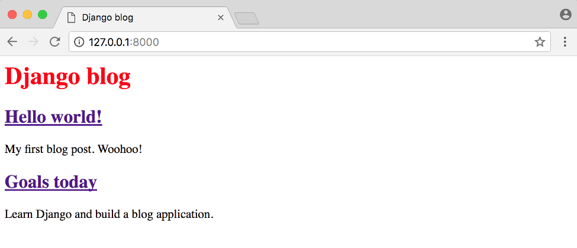
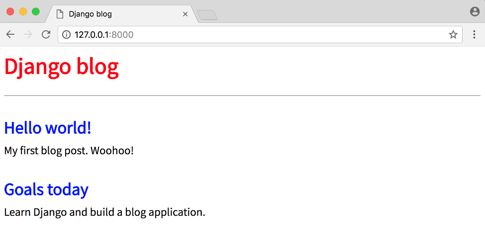
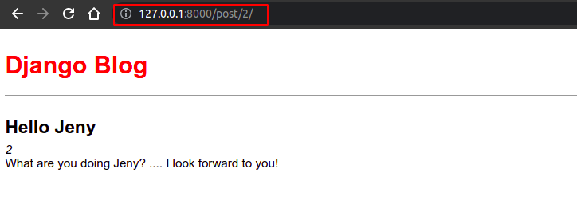

# Blog App using Django

In this chapter we’ll build a Blog application that allows users to create, edit, and delete
posts. The homepage will list all blog posts and there will be a dedicated detail page
for each individual post. We’ll also introduce CSS for styling and learn how Django
works with static files.

## Table of Contents

- [Blog App using Django](#blog-app-using-django)
  - [Table of Contents](#table-of-contents)
    - [Initial Setup](#initial-setup)
    - [Database Models](#database-models)
    - [Admin](#admin)
    - [URLs](#urls)
    - [Views](#views)
    - [Templates](#templates)
    - [Static Files](#static-files)
    - [Individual Blog Pages](#individual-blog-pages)
    - [Tests](#tests)

### Initial Setup

As covered in previous chapters, our steps for setting up a new Django project are as
follows:

- Create a new directory for our code on the Desktop called `blog`
- Install `Django` in a new virtual environment
- Create a new Django project called `blog_project`
- Create a new app `blog`
- Perform a `migration` to set up the database
- Update `settings.py`

```bash
$ mkdir blog
$ cd blog
$ pipenv install django
$ pipenv shell
$ django-admin startproject blog_project .
$ python manage.py startapp blog
$ python manage.py migrate
$ python manage.py runserver
```

To ensure `Django knows about our new app`, open your text editor and add the new
app to `INSTALLED_APPS` in our `settings.py` file:

```py
# blog_project/settings.py
INSTALLED_APPS = [
    'django.contrib.admin',
    'django.contrib.auth',
    'django.contrib.contenttypes',
    'django.contrib.sessions',
    'django.contrib.messages',
    'django.contrib.staticfiles',
    'blog', # new
]
```


### Database Models

What are the `characteristics` of a typical blog application? In our case let’s keep things
simple and assume each post has a `title`, `author`, and `body`. We can turn this into a
database model by opening the `blog/models.py` file and entering the code below:

```py
# blog/models.py
from django.db import models

class Post(models.Model):
    title = models.TextField(max_length=200)
    author = models.ForeignKey(
        'auth.User',
        on_delete=models.CASCADE,
    )
    body = models.TextField()

    def __str__(self):
        return self.title
```

For `title` we’re limiting the `length to 200 characters` and for body we’re using a
`TextField` which will `automatically expand` as needed to fit the user’s text. There are
many field types available in Django.

For the author field we’re using a `ForeignKey` which allows for a `many-to-one` relationship.
This means that a given user can be the author of many different blog posts
but not the other way around. The `reference` is to the `built-in User model` that Django
provides for `authentication`. For all `many-to-one` relationships such as a `ForeignKey`
we must also specify an `on_delete` option.

Now that our new database model is created we need to create a new `migration`
record for it and `migrate` the change into our database. This `two-step process` can
be completed with the commands below:

```bash
$ python manage.py makemigrations
$ python manage.py migrate
```

Our database is configured! What’s next?

### Admin

We need a way to access our data. Enter the Django admin! First create a superuser
account by typing the command below and following the prompts to set up an email
and password. Note that when typing your password, it will not appear on the screen
for security reasons.

```bash
$python manage.py createsuperuser
Username (leave blank to use 'nahid'): nahid
Email address: nahid.cseru@gmail.com
Password:
Password (again):
Superuser created successfully.
```

Now start running the Django server again with the command `python manage.py runserver`
and open up the Django admin at http://127.0.0.1:8000/admin/. Login with
your new superuser account.

Oops! Where’s our new Post model?


We forgot to update blog/admin.py so let’s do that now.

```py
# blog/admin.py
from django.contrib import admin
from . import models

# Register your models here.
admin.site.register(models.Post)
```

If you refresh the page you’ll see the update.


Let’s `add two blog posts` so we have some sample data to work with. Click on the + Add
button next to Posts to create a new entry. Make sure to add an `“author”` to each post
too since `by default all model fields are required`. If you try to enter a post without an
author you will see an error. If we wanted to change this, we could add `field options`
to our model to `make a given field optional or fill it with a default value`.

**Don't put required value(ERROR)**:


**All Post**:


Now that our `database model is complete` we need to create the necessary `views, URLs, and templates`
so we can display the information on our web application.

### URLs

We want to display our blog posts on the homepage so, as in previous chapters,
we’ll first configure our **project-level URLConfs** and then our **app-level URLConfs**
to achieve this. Note that `“project-level”` means in the `same parent folder` as the
`blog_project` and blog app folders.

**App level URLConfs**:

- Crate `urls.py` file in `blog` app.

```bash
$ touch blog/urls.py
```

- Open `urls.py` file and edit on it...

```py
# blog/urls.py
from django.urls import path
from . import views

urlpatterns = [
    path("", views.BlogListView.as_view(), name='home'),
]
```

We’re importing our `soon-to-be-created views at the top`. The empty string `''` tells
Python to match all values and we make it a named URL, home , which we can refer to
in our views later on. While it’s `optional to add a named URL it’s a best practice` you
should adopt as it helps keep things organized as your number of URLs grows.

We also should update our `project-level urls.py` file so that it knows to forward all
requests directly to the blog app.

```py
# blog_project/urls.py
from django.contrib import admin
from django.urls import path, include

urlpatterns = [
    path('admin/', admin.site.urls),
    path('', include('blog.urls')),
]
```

We’ve added include on the second line and a urlpattern using an empty string regular
expression '' indicating that URL requests should be redirected as is to blog ’s URLs
for further instructions.

### Views

We’re going to use `class-based views` but if want to see a `function-based` way to build
a blog application, I highly recommend the **Django Girls Tutorial**. It is excellent.

In our views file, add the code below to display the contents of our Post model using
`ListView` .

```py
from django.shortcuts import render
from django.views.generic import ListView
from .models import Post

class BlogListView(ListView):
    model = Post
    template_name = 'blog/home.html'
```

On the top two lines we import ListView and our database model Post . Then we
subclass ListView and add links to our model and template. This saves us a lot of
code versus implementing it all from scratch.

> **Note**: BlogListView return and **object_list**

### Templates

With our `URLConfs` and `views` now complete, we’re only missing the third piece of
the puzzle: **templates**. As we already saw in Chapter 4, we can **inherit** from other
templates to keep our code clean. Thus we’ll start off with a `base.html` file and a
`home.html` file that `inherits` from it. Then later when we add templates for creating
and editing blog posts, they too can inherit from `base.html` .

Start by creating our `project-level` templates directory with the `two template files`.

```bash
# inside project dir
$ mkdir templates/blog
$ touch templates/blog/base.html templates/blog/home.html
```

Then **update** `settings.py` so Django knows to `look there for our templates`.

```py
# blog_project/settings.py
import os

TEMPLATES = [
    {
        ...
            'DIRS': [os.path.join(BASE_DIR, 'templates')],
        ...
    },
]
```

Then update the `base.html` template as follows.

```html
<!-- project/templates/blog/base.html -->
<!DOCTYPE html>
<html lang="en">
  <head>
    <meta charset="UTF-8" />
    <meta name="viewport" content="width=device-width, initial-scale=1.0" />
    <title>Django Blog</title>
  </head>
  <body>
    <header>
      <h1><a href="/">Django Blog</a></h1>
    </header>

    <div class="container"> </div>
  </body>
</html>
```

Note that code between ` and ` can be
**filled** by other templates. Speaking of which, here is the code for `home.html` .

```html
<!-- project/templates/blog/base.html -->
  
<div class="post-entry">
  <h2><a href="">{{ post.title }}</a></h2>
  <p>{{ post.body }}</p>
</div>
 
```

At the top we note that this template **extends** `base.html` and then wraps our desired
code with `content blocks`. We use the Django Templating Language to set up a simple
for loop for each blog post. Note that object_list comes from ListView and contains
all the objects in our view.

If you start the Django server again: `python manage.py runserver`.


### Static Files

We need to add some **CSS** which is referred to as a **static** file because, unlike our
`dynamic database content, it doesn’t change`. Fortunately it’s straightforward to add
static files like **CSS**, **JavaScript**, and **images** to our Django project.

In a **production-ready Django project** you would typically store this on a
**Content Delivery Network (CDN) for better performance**, but for our purposes storing the
files locally is fine.

Then create a `project-level` folder called **static** .

```bash
$ mkdir static
```

Just as we did with our templates folder we need to update `settings.py` to tell Django
where to look for these `static files`. We can update `settings.py` with a one-line change
for **STATICFILES_DIRS** . Add it at the **bottom** of the file below the entry for **STATIC_URL** .

```py
# BELOW THE STATIC_URLS
STATICFILES_DIRS = [os.path.join(BASE_DIR, 'static')] #List
```

Now create a css folder within static and add a new base.css file in it.

```bash
$ cd static
$ mkdir static/blog/css/
$ touch static/blog/css/base.css
```

What should we put in our file? How about changing the title to be purple?

```py
# blog_project/settings.py
header h1 a{
    color: red;
}
```

Last step now. We need to add the `static files` to our `templates` by adding
`` to the top of `base.html` . Because our other templates inherit from
base.html we only have to add this once. Include a new line at the bottom of the
`<head></head>` code that `explicitly references` our new `base.css` file.

```html
<!-- project/templates/blog/base.html -->

<!DOCTYPE html>
<html lang="en">
  <head>
    <meta charset="UTF-8" />
    <meta name="viewport" content="width=device-width, initial-scale=1.0" />
    <link rel="stylesheet" href="" />
    <link
      href="https://fonts.googleapis.com/css?family=Source+Sans+Pro:stylesheet"
    />
    <title>Django Blog</title>
  </head>
  <body>
    <header>
      <h1><a href="/">Django Blog</a></h1>
    </header>

    <div class="container"> </div>
  </body>
</html>
```

Start up the server again with python manage.py runserver and look at our updated
homepage at http://127.0.0.1:8000/.



Add more style...

```css
* {
  box-sizing: border-box;
}

body {
  font-family: "Source Sans Pro", sans-serif;
  font-size: 19px;
}

header {
  border-bottom: 1px solid #999;
  margin-bottom: 2rem;
  display: flex;
}

header h1 a {
  color: red;
  text-decoration: none;
}

.nav-left {
  margin-right: auto;
}

.nav-right {
  display: flex;
  padding-top: 2rem;
}

.post-entry h2 {
  margin: 0.5rem 0;
}

.post-entry h2 a,
.post-entry h2 a:visited {
  color: blue;
  text-decoration: none;
}

.post-entry p {
  margin: 0;
  font-weight: 400;
}

.post-entry h2 a:hover {
  color: red;
}
```

Refresh the homepage at http://localhost:8000/ and you should see the following.



### Individual Blog Pages

Now we can add the functionality for individual blog pages. How do we do that?
We need to create a new `view, url, and template`. I hope you’re noticing a pattern
in development with Django now!

Start with the view. We can use the generic class-based **DetailView** to simplify things.
At the top of the file add DetailView to the list of imports and then create our new
view called **BlogDetailView** .

```py
from django.shortcuts import render
from django.views.generic import ListView, DetailView
from .models import Post

class BlogListView(ListView):
    model = Post
    template_name = 'blog/home.html'

class BlogDetailView(DetailView):
    model = Post
    template_name = 'post_detail.html'
```

In this new view we define the model we’re using, `Post` , and the template we want
it associated with, `post_detail.html` . By default **DetailView** will provide a
**context object** we can use in our template called either **object** or the lowercase name of
our model, **post** . Also, `DetailView` expects either a `primary key` or a `slug` passed to it
as the **identifier**. More on this shortly.

```html
<!-- projects/templates/blog/post_detail.html -->
 
<div class="post-entry">
  <h2>{{ post.title }}</h2>
  <p>{{ post.body }}</p>
</div>

```

At the top we specify that this template `inherits from base.html` . Then display the
`title` and `body` from our `context object`, which DetailView makes accessible as **post** .

Personally I found the naming of `context objects` in generic views extremely **confusing**
when first learning Django. Because our `context object` from **DetailView** is either our
model name `post` or `object` we could also update our template as follows and it would
work exactly the same.

```html
<!-- projects/templates/blog/post_detail.html -->
 
<div class="post-entry">
  <h2>{{ object.title }}</h2>
  <p>{{ object.body }}</p>
</div>

```

If you find using post or object confusing, we can also explicitly set the name of the
context object in our view. So if we wanted to call it anything_you_want and then use
that in the template, the code would look as follows and it would work the same.

```py
# blog/views.py

....

class BlogDetailView(DetailView):
  model = Post
  template_name = 'blog/post_detail.html'
  context_object_name = 'anything_you_want'
```

Using `anything_you_want` as a context name for BlogDetailView Class

```html
<!-- projects/templates/blog/post_detail.html -->
 
<div class="post-entry">
  <h2>{{ anything_you_want.title }}</h2>
  <p>{{ anything_you_want.body }}</p>
</div>

```

Ok, what’s next? How about adding a new **URLConf** for our view, which we can do as
follows.

**Note**:

1. If you set `context_object_name` you cannot access data using `post`(lowercase model name) otherwise you can.
2. You can always access data using `object`(as a context name)

```py
# blog/urls.py
from django.urls import path
from . import views

urlpatterns = [
    path("", views.BlogListView.as_view(), name='home'),
    path("post/<int:pk>/", views.BlogDetailView.as_view(), name='post_detail'),
]
```

All blog post entries will start with `post/` . Next is the primary key for our post entry
which will be represented as an integer `<int:pk>` . What’s the primary key you’re
probably asking? `Django automatically adds an auto-incrementing primary key` to our
database models. So while we only declared the fields `title` , `author` , and `body` on our
Post model, under-the-hood Django also added another field called `id` , which is our
primary key. We can access it as either `id` or `pk` .

The pk for our first “Hello, World” post is 1. For the second post, it is 2. And so on.
Therefore when we go to the individual entry page for our first post, we can expect
that its urlpattern will be `post/`



To make our **life easier**, we should update the link on the homepage so we can directly
access individual blog posts from there. Currently in `home.html` our link is empty:
`<a href="">` . Update it to `<a href="">` .

Or update it to `<a href="">`

> To confirm everything works, refresh the main page at http://127.0.0.1:8000/ and click on the title of each blog post to confirm the new links work.

### Tests

We need to test our model and views now. We want to ensure that the Post model
works as expected, including its `str` representation. And we want to test both **ListView**
and **DetailView** .

```py
from django.http import response
from django.test import TestCase, Client
from django.contrib.auth import get_user_model
from django.urls import reverse

from .models import Post


class BlogTest(TestCase):

    def setUp(self):
        self.user = get_user_model().objects.create_user(
            username='testuser',
            email='test@email.com',
            password='secret',
        )

        self.post = Post.objects.create(
            title='A good title',
            body='Nice body content',
            author=self.user
        )

    def test_string_representation(self):
        post = Post(title='A sample title')
        # print(post)
        self.assertEqual(str(post), post.title)

    def test_post_content(self):
        # print(self.post)
        self.assertEqual(f'{ self.post.title }', 'A good title')
        self.assertEqual(f'{ self.post.author }', 'testuser')
        self.assertEqual(f'{ self.post.body }', 'Nice body content')

    def test_post_list_view(self):
        response = self.client.get(reverse('home'))
        # print(response)
        self.assertEqual(response.status_code, 200)
        # print(response.content)
        self.assertContains(response, "A good title")
        self.assertTemplateUsed('home')
        self.assertTemplateNotUsed('post_detail')

    def test_post_detail_view(self):
        response = self.client.get('/post/1/')
        print(response)
        no_response = self.client.get("/post/1000/")

        self.assertEqual(response.status_code, 200)
        self.assertEqual(no_response.status_code, 404)
        self.assertContains(response, 'A good title')
        self.assertContains(response, "Nice body content")
        self.assertTemplateUsed('post_detail')
        # self.assertTemplateUsed('post_detail.html') # same as previous
```

There’s a lot that’s new in these tests so we’ll walk through them slowly. At the top
we import **get_user_model** to reference our **active User**. We import which
we’ve seen before and also **Client()** which is new and `used as a dummy Web browser`
for simulating `GET` and `POST` requests on a `URL`. In other words, whenever you’re
testing views you should use `Client()` .

In our setUp method we add a sample blog post to test and then confirm that both its
string representation and content are correct. Then we use test_post_list_view to
confirm that our homepage returns a `200` HTTP status code, contains our body text,
and uses the correct `home.html` template. Finally test_post_detail_view tests that our
detail page works as expected and that an incorrect page returns a 404.
`It’s always good to both test that something does exist and that something incorrect doesn’t exist in your tests.`
Go ahead and run these tests now. They should all pass.

```bash
$ python manage.py runserver
$ git init && git add --all && git commit -m 'blog app added'
```