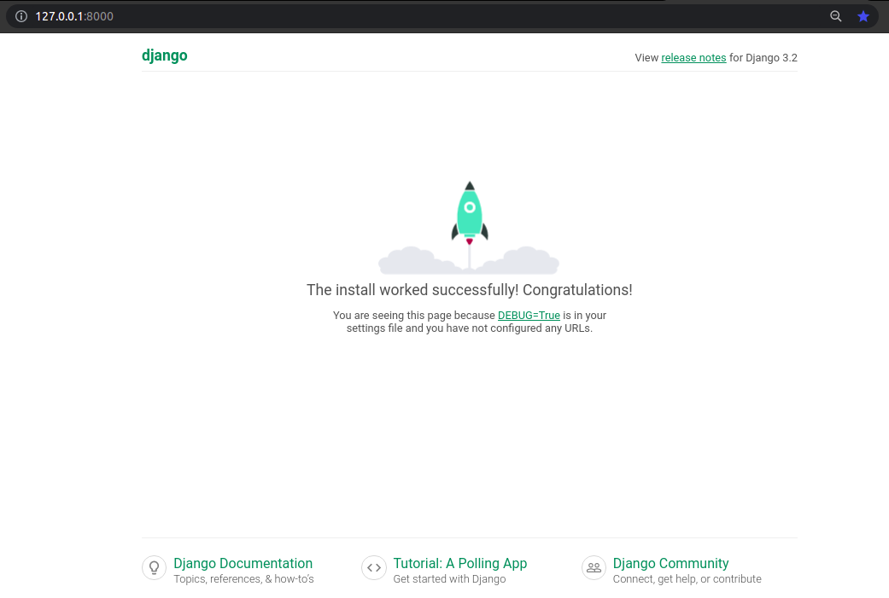
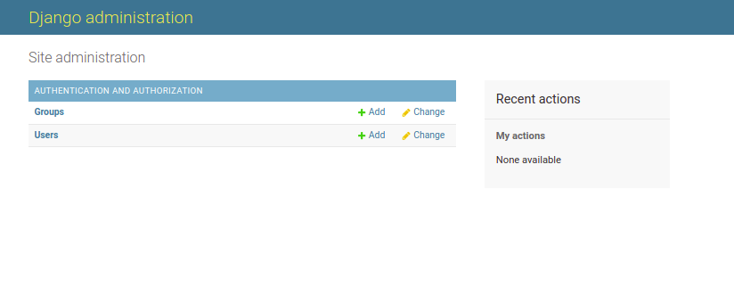
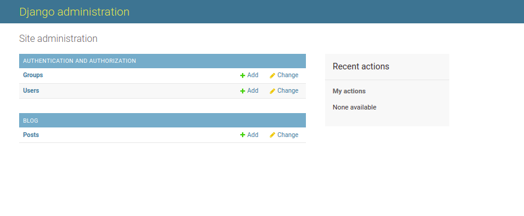
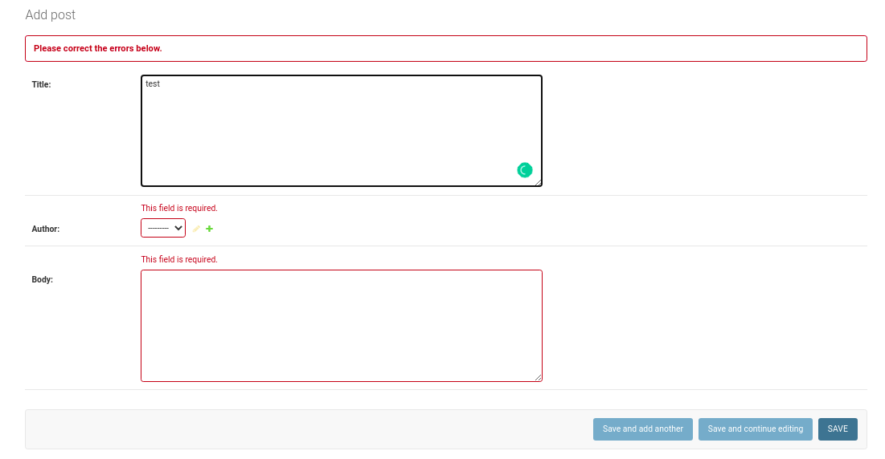
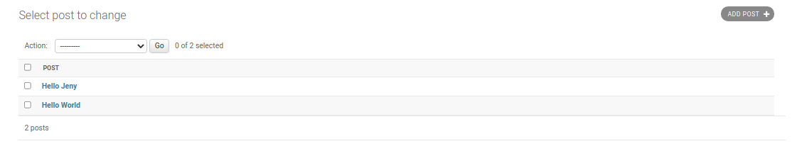
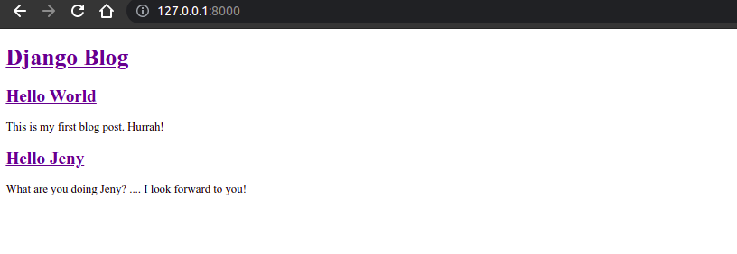

# Blog App using Django

In this chapter we’ll build a Blog application that allows users to create, edit, and delete
posts. The homepage will list all blog posts and there will be a dedicated detail page
for each individual post. We’ll also introduce CSS for styling and learn how Django
works with static files.

## Table of Contents

- [Blog App using Django](#blog-app-using-django)
  - [Table of Contents](#table-of-contents)
    - [Initial Setup](#initial-setup)
    - [Database Models](#database-models)
    - [Admin](#admin)
    - [URLs](#urls)
    - [Views](#views)
    - [Templates](#templates)
    - [Static Files](#static-files)

### Initial Setup

As covered in previous chapters, our steps for setting up a new Django project are as
follows:

- Create a new directory for our code on the Desktop called `blog`
- Install `Django` in a new virtual environment
- Create a new Django project called `blog_project`
- Create a new app `blog`
- Perform a `migration` to set up the database
- Update `settings.py`

```bash
$ mkdir blog
$ cd blog
$ pipenv install django
$ pipenv shell
$ django-admin startproject blog_project .
$ python manage.py startapp blog
$ python manage.py migrate
$ python manage.py runserver
```

To ensure `Django knows about our new app`, open your text editor and add the new
app to `INSTALLED_APPS` in our `settings.py` file:

```py
# blog_project/settings.py
INSTALLED_APPS = [
    'django.contrib.admin',
    'django.contrib.auth',
    'django.contrib.contenttypes',
    'django.contrib.sessions',
    'django.contrib.messages',
    'django.contrib.staticfiles',
    'blog', # new
]
```



### Database Models

What are the `characteristics` of a typical blog application? In our case let’s keep things
simple and assume each post has a `title`, `author`, and `body`. We can turn this into a
database model by opening the `blog/models.py` file and entering the code below:

```py
# blog/models.py
from django.db import models

class Post(models.Model):
    title = models.TextField(max_length=200)
    author = models.ForeignKey(
        'auth.User',
        on_delete=models.CASCADE,
    )
    body = models.TextField()

    def __str__(self):
        return self.title
```

For `title` we’re limiting the `length to 200 characters` and for body we’re using a
`TextField` which will `automatically expand` as needed to fit the user’s text. There are
many field types available in Django.

For the author field we’re using a `ForeignKey` which allows for a `many-to-one` relationship.
This means that a given user can be the author of many different blog posts
but not the other way around. The `reference` is to the `built-in User model` that Django
provides for `authentication`. For all `many-to-one` relationships such as a `ForeignKey`
we must also specify an `on_delete` option.

Now that our new database model is created we need to create a new `migration`
record for it and `migrate` the change into our database. This `two-step process` can
be completed with the commands below:

```bash
$ python manage.py makemigrations
$ python manage.py migrate
```

Our database is configured! What’s next?

### Admin

We need a way to access our data. Enter the Django admin! First create a superuser
account by typing the command below and following the prompts to set up an email
and password. Note that when typing your password, it will not appear on the screen
for security reasons.

```bash
$python manage.py createsuperuser
Username (leave blank to use 'nahid'): nahid
Email address: nahid.cseru@gmail.com
Password:
Password (again):
Superuser created successfully.
```

Now start running the Django server again with the command `python manage.py runserver`
and open up the Django admin at http://127.0.0.1:8000/admin/. Login with
your new superuser account.

Oops! Where’s our new Post model?



We forgot to update blog/admin.py so let’s do that now.

```py
# blog/admin.py
from django.contrib import admin
from . import models

# Register your models here.
admin.site.register(models.Post)
```

If you refresh the page you’ll see the update.



Let’s `add two blog posts` so we have some sample data to work with. Click on the + Add
button next to Posts to create a new entry. Make sure to add an `“author”` to each post
too since `by default all model fields are required`. If you try to enter a post without an
author you will see an error. If we wanted to change this, we could add `field options`
to our model to `make a given field optional or fill it with a default value`.

**Don't put required value(ERROR)**:



**All Post**:



Now that our `database model is complete` we need to create the necessary `views, URLs, and templates`
so we can display the information on our web application.

### URLs

We want to display our blog posts on the homepage so, as in previous chapters,
we’ll first configure our **project-level URLConfs** and then our **app-level URLConfs**
to achieve this. Note that `“project-level”` means in the `same parent folder` as the
`blog_project` and blog app folders.

**App level URLConfs**:

- Crate `urls.py` file in `blog` app.

```bash
$ touch blog/urls.py
```

- Open `urls.py` file and edit on it...

```py
# blog/urls.py
from django.urls import path
from . import views

urlpatterns = [
    path("", views.BlogListView.as_view(), name='home'),
]
```

We’re importing our `soon-to-be-created views at the top`. The empty string `''` tells
Python to match all values and we make it a named URL, home , which we can refer to
in our views later on. While it’s `optional to add a named URL it’s a best practice` you
should adopt as it helps keep things organized as your number of URLs grows.

We also should update our `project-level urls.py` file so that it knows to forward all
requests directly to the blog app.

```py
# blog_project/urls.py
from django.contrib import admin
from django.urls import path, include

urlpatterns = [
    path('admin/', admin.site.urls),
    path('', include('blog.urls')),
]
```

We’ve added include on the second line and a urlpattern using an empty string regular
expression '' indicating that URL requests should be redirected as is to blog ’s URLs
for further instructions.

### Views

We’re going to use `class-based views` but if want to see a `function-based` way to build
a blog application, I highly recommend the **Django Girls Tutorial**. It is excellent.

In our views file, add the code below to display the contents of our Post model using
`ListView` .

```py
from django.shortcuts import render
from django.views.generic import ListView
from .models import Post

class BlogListView(ListView):
    model = Post
    template_name = 'blog/home.html'
```

On the top two lines we import ListView and our database model Post . Then we
subclass ListView and add links to our model and template. This saves us a lot of
code versus implementing it all from scratch.

> **Note**: BlogListView return and **object_list**

### Templates

With our `URLConfs` and `views` now complete, we’re only missing the third piece of
the puzzle: **templates**. As we already saw in Chapter 4, we can **inherit** from other
templates to keep our code clean. Thus we’ll start off with a `base.html` file and a
`home.html` file that `inherits` from it. Then later when we add templates for creating
and editing blog posts, they too can inherit from `base.html` .

Start by creating our `project-level` templates directory with the `two template files`.

```bash
# inside project dir
$ mkdir templates/blog
$ touch templates/blog/base.html templates/blog/home.html
```

Then **update** `settings.py` so Django knows to `look there for our templates`.

```py
# blog_project/settings.py
import os

TEMPLATES = [
    {
        ...
            'DIRS': [os.path.join(BASE_DIR, 'templates')],
        ...
    },
]
```

Then update the `base.html` template as follows.

```html
<!-- project/templates/blog/base.html -->
<!DOCTYPE html>
<html lang="en">
  <head>
    <meta charset="UTF-8" />
    <meta name="viewport" content="width=device-width, initial-scale=1.0" />
    <title>Django Blog</title>
  </head>
  <body>
    <header>
      <h1><a href="/">Django Blog</a></h1>
    </header>

    <div class="container"> </div>
  </body>
</html>
```

Note that code between ` and ` can be
**filled** by other templates. Speaking of which, here is the code for `home.html` .

```html
<!-- project/templates/blog/base.html -->
  
<div class="post-entry">
  <h2><a href="">{{ post.title }}</a></h2>
  <p>{{ post.body }}</p>
</div>
 
```

At the top we note that this template **extends** `base.html` and then wraps our desired
code with `content blocks`. We use the Django Templating Language to set up a simple
for loop for each blog post. Note that object_list comes from ListView and contains
all the objects in our view.

If you start the Django server again: `python manage.py runserver`.



### Static Files

We need to add some **CSS** which is referred to as a **static** file because, unlike our
`dynamic database content, it doesn’t change`. Fortunately it’s straightforward to add
static files like **CSS**, **JavaScript**, and **images** to our Django project.

In a **production-ready Django project** you would typically store this on a
**Content Delivery Network (CDN) for better performance**, but for our purposes storing the
files locally is fine.

Then create a `project-level` folder called **static** .

```bash
$ mkdir static
```

Just as we did with our templates folder we need to update `settings.py` to tell Django
where to look for these `static files`. We can update `settings.py` with a one-line change
for **STATICFILES_DIRS** . Add it at the **bottom** of the file below the entry for **STATIC_URL** .

```py
# BELOW THE STATIC_URLS
STATICFILES_DIRS = [os.path.join(BASE_DIR, 'static')] #List
```

Now create a css folder within static and add a new base.css file in it.

```bash
$ cd static
$ mkdir static/blog/css/
$ touch static/blog/css/base.css
```

What should we put in our file? How about changing the title to be purple?

```py
# blog_project/settings.py
header h1 {
    color: purple;
}
```

Last step now. We need to add the `static files` to our `templates` by adding 
`` to the top of `base.html` . Because our other templates inherit from
base.html we only have to add this once. Include a new line at the bottom of the
`<head></head>` code that `explicitly references` our new `base.css` file.

```html
<!-- project/templates/blog/base.html -->

```