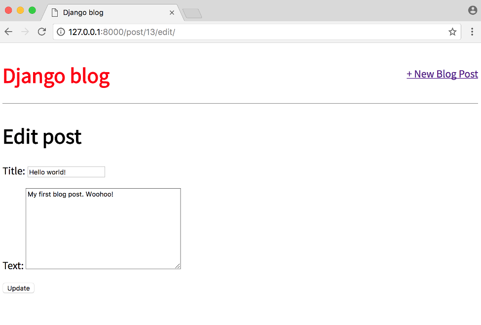

# Django Forms

## Table of Contents

- [Django Forms](#django-forms)
  - [Table of Contents](#table-of-contents)
    - [Forms](#forms)
    - [Update Form](#update-form)
    - [Delete View](#delete-view)
    - [Tests](#tests)
    - [Conclusion](#conclusion)

### Forms

**Forms** are very common and very **complicated** to implement correctly. Any time you
are accepting user input there are security concerns `(XSS Attacks)`, proper error
handling is required, and there are UI considerations around how to **alert** the user
to problems with the form. Not to mention the need for **redirects** on **success**.
Fortunately for us `Django’s built-in Forms` abstract away much of the difficulty and
provide a rich set of tools to handle common use cases working with forms.

To start, update our `base` template to display a link to a page for entering new blog
posts. It will take the form `<a href=""></a>` where post_new is
the name for our URL.
Your updated file should look as follows:

```html
.......
<div class="container">
  <header>
    <div class="nav-left">
      <h1><a href="/">Django Blog</a></h1>
    </div>
    <div class="nav-right">
      <a href="">+ New Blog Post</a>
    </div>
  </header>
   
</div>
.......
```

Let’s add a new **URLConf** for `post_new` now:

```py
from django.urls import path
from . import views

urlpatterns = [
    path("", views.BlogListView.as_view(), name='home'),
    path("post/<int:pk>/", views.BlogDetailView.as_view(), name='post_detail'),
    path("post/new/", views.BlogCreateView.as_view(), name='post_new'),
]
```

Our url will start with `post/new/` , the view is called **BlogCreateView** , and the url will be
named `post_new` . Simple, right?
Now let’s create our view by importing a new generic class called `CreateView` and then
subclass it to create a new view called `BlogCreateView`

```py
from django.shortcuts import render
from django.views.generic import ListView, DetailView
from django.views.generic.edit import CreateView
from .models import Post

# .......

class BlogCreateView(CreateView):
    model = Post
    template_name = 'blog/post_new.html'
    # show all the field in the form
    fields = '__all__'

```

Within BlogCreateView we specify our database model `Post` , the name of our template
`post_new.html` , and all fields with `'__all__'` since we only have two: `title` and `author` .
The last step is to create our `template`, which we will call `post_new.html` .

```html
 
<h1>New Post</h1>
<form action="" method="post">
   {{ form.as_p }}
  <input type="submit" value="save" />
</form>

```

### Update Form

The process for creating an update form so users can edit blog posts should feel
familiar. We’ll again use a built-in Django class-based `generic view`, **UpdateView**, and
create the requisite `template`, `url`, and `view`.

To start, let's add a new link to `post_detail.html` so that the option to edit a blog post appears on an individual blog page.

```html
<!-- projects/templates/blog/post_detail.html -->
 
<div class="post-entry">
  <h2>{{ post.title }}</h2>
  <p><em> {{ post.id }} </em></p>
  <p>{{ post.body }}</p>
</div>

<a href="">+Edit Blog Post</a>


```

We’ve added a link using `<a href>...</a>` and the `Django template engine’s`
`` tag. Within it we’ve specified the target name of our `url`, which will be called
`post_edit` and also passed the parameter needed, which is the primary key of the post
`post.pk` .

Next we create the template for our edit page called `post_edit.html` .

```html
 
<h1>Edit Post</h1>
<form action="" method="post">
   {{ form.as_p }}
  <input type="submit" value="Update" />
</form>

```

We again use HTML `<form></form>` tags, Django’s `csrf_token` for security, `form.as_p`
to display our form fields with paragraph tags, and finally give it the value `“Update”`
on the `submit button`.

Now to our view. We need to import `UpdateView` on the second-from-the-top line and
then subclass it in our new view `BlogUpdateView` .

```py
from django.shortcuts import render
from django.views.generic import ListView, DetailView
from django.views.generic.edit import CreateView, UpdateView
from .models import Post

# .......

class BlogUpdateView(UpdateView):
    model = Post
    template_name = 'blog/post_edit'
    fields = ['title', 'body']
```

Notice that in BlogUpdateView we are explicitly listing the fields we want to use
`['title', 'body']` rather than using `'__all__'` . This is because we assume that the
`author of the post is not changing`; we only want the title and text to be editable.

The final step is to update our `urls.py` file as follows:

```py
from django.urls import path
from . import views

urlpatterns = [
    # ...............
    path("post/<int:pk>/edit/", views.BlogUpdateView.as_view(), name='post_edit'),
]
```

At the top we add our view `BlogUpdateView` to the list of imported `views`, then created
a new url pattern for `/post/pk/edit` and given it the name `post_edit`.

If you click on “+ Edit Blog Post” you’ll be redirected to http://127.0.0.1:8000/post/1/edit/
if it’s your first blog post.



And after clicking the `“Update”` button we are redirected to the detail view of the
post where you can see the change. This is because of our `get_absolute_url` setting.
Navigate to the homepage and you can see the change next to all the other entries.

### Delete View

The process for creating a form to delete blog posts is very similar to that for updating
a post. We’ll use yet another generic class-based view, **DeleteView**, to help and need
to create a view, url, and template for the functionality.

Let’s start by adding a link to delete blog posts on our individual blog page, ` post_detail.html`.

```html
<!-- templates/post_detail.html -->
 
<div class="post-entry">
  <h2>{{ object.title }}</h2>
  <p>{{ object.body }}</p>
</div>
<p><a href="">+ Edit Blog Post</a></p>
<p><a href="">+ Delete Blog Post</a></p>

```

Then create a new file for our delete page template. First quit the local server Control-
c and then type the following command:

```bash
$ touch templates/blog/post_delete.html
```

```html
<!-- templates/post_delete.html -->
 
<h1>Delete post</h1>
<form action="" method="post">
  
  <p>Are you sure you want to delete "{{ post.title }}"?</p>
  <input type="submit" value="Confirm" />
</form>

```

Note we are using post.title here to display the title of our blog post. We could also
just use `object.title` as it too is provided by **DetailView** .
Now update our views.py file, by importing DeleteView and reverse_lazy at the top,
then create a new view that subclasses **DeleteView** .

```py
from django.views.generic.edit import DeleteView
from django.urls import reverse_lazy

# .......
class BlogDeleteView(DeleteView):
    model = Post
    template_name = 'post_delete.html'
    success_url = reverse_lazy('home')
```

We use `reverse_lazy` as opposed to just reverse so that it `won’t execute` the URL
redirect `until our view has finished deleting the blog post`.

Finally add a **url** by importing our view BlogDeleteView and adding a new pattern:

```py
path('post/<int:pk>/delete/', views.BlogDeleteView.as_view(), name='post_delete'),
```

If you start the server again python manage.py runserver and refresh the individual
post page you’ll see our `“Delete Blog Post”` link.

### Tests

Time for tests to make sure everything works now–and in the future–as expected.
We’ve added a get_absolute_url method to our model and new views for create,
update, and edit posts. That means we need four new tests:
- `def test_get_absolute_url`
- `def test_post_create_view`
- `def test_post_update_view`
- `def test_post_delete_view`

Update your existing `tests.py` file as follows.

```py
from django.test import TestCase
from .models import Post
from django.urls import reverse
# Create your tests here.


class PostModelTest(TestCase):

    # not used for test
    def setUp(self):
        # create a simple post, text is our model field
        Post.objects.create(text='just a test')

    # used for test because this method
    # start with "test_something"
    def test_text_content(self):
        post = Post.objects.get(id=1)
        excepted_object_name = f'{post.text}'
        self.assertEqual(excepted_object_name, 'just a test')


class HomePageViewTest(TestCase):

    def setUp(self):
        Post.objects.create(text='this is another test')

    def test_view_url_exists_at_proper_location(self):
        print(Post.objects.all())
        resp = self.client.get('/')
        self.assertEqual(resp.status_code, 200)

    def test_view_url_by_name(self):
        # reverse(optional_name) return the
        # actual url, for current situation it is just '/'
        resp = self.client.get(reverse('home'))
        self.assertEqual(resp.status_code, 200)

    def test_view_uses_correct_template(self):
        resp = self.client.get(reverse('home'))
        self.assertEqual(resp.status_code, 200)
        print(resp)
        self.assertTemplateUsed(resp, 'posts/home.html')
```

We expect the url of our test to be at `post/1/` since there’s only one post and the
is its primary key Django adds automatically for us. To test create view we make a
new response and then ensure that the response goes through (status code 200) and
contains our new title and body text. For update view we access the first post–which
has a **pk** of
which is passed in as the only argument–and we confirm that it results
in a `302 redirect`. Finally we test our delete view by confirming that if we delete a post
the status code is 200 for success.

There’s always more tests that can be added but this at least has coverage on all our
new functionality.

### Conclusion

In a small amount of code we’ve built a blog application that allows for creating,
reading, updating, and deleting blog posts. This core functionality is known by
the acronym **CRUD**: **Create-Read-Update-Delete**. While there are multiple ways to
achieve this same functionality–we could have used function-based views or written
our own class-based views–we’ve demonstrated how little code it takes in Django to
make this happen.
