# Learn Django Beginners to Professionals

## Table of Contents

- [Learn Django Beginners to Professionals](#learn-django-beginners-to-professionals)
  - [Table of Contents](#table-of-contents)
    - [Django for Beginners](#django-for-beginners)
      - [Why Django](#why-django)
      - [Python Hello World](#python-hello-world)
      - [Initial Setup](#initial-setup)
      - [Git and Visual Studio Code](#git-and-visual-studio-code)
      - [Hello World Application](#hello-world-application)
      - [Create an app](#create-an-app)
      - [Views and URLConfs](#views-and-urlconfs)
      - [Deploy on Github](#deploy-on-github)
      - [Pages App](#pages-app)
      - [Templates](#templates)
      - [Class-Based View](#class-based-view)
      - [URLs](#urls)
      - [Extending Templates](#extending-templates)
      - [Tests](#tests)
      - [Local vs Production](#local-vs-production)
      - [Sign Up in Heroku and Login in Heroku CLI](#sign-up-in-heroku-and-login-in-heroku-cli)
      - [Additional Files](#additional-files)
      - [Deploy](#deploy)
      - [Message Board app](#message-board-app)
      - [Creating a Database Model](#creating-a-database-model)
      - [Activating Models](#activating-models)
      - [Django Admin](#django-admin)
      - [Views, Templates and URLs](#views-templates-and-urls)
      - [Adding Test in MB Project](#adding-test-in-mb-project)
      - [Heroku Configuration and Deploy the Message Book Application](#heroku-configuration-and-deploy-the-message-book-application)
- [Add files into the Github](#add-files-into-the-github)
      - [Blog App](#blog-app)

### Django for Beginners

Django is a free, open source web framework written in the Python programming
language and used by millions of programmers every year. Its popularity is due to its
friendliness to both beginners and advanced programmers: Django is robust enough
to be used by the largest websites in the world– `Instagram`, `Pinterest`, `Bitbucket`,
`Disqus`–but also flexible enough to be a good choice for early-stage startups and
prototyping personal projects.

#### Why Django

A web framework is a collection of modular tools that abstracts away much of the
difficulty–and repetition–inherent in web development.

Django inherited Python’s “batteries-included” approach and includes out-of-the box
support for common tasks in web development:

- User **Authentication**
- **Templates**, **Routes**, And **Views**
- **Admin** Interface
- Robust **Security**
- Support for **Multiple Database** Backends
- and much much more

#### Python Hello World

```py
# This is Python code
print("Hello, world!")
```

#### Initial Setup

**Configure** your computer to work on Django projects. We start with an overview of the **command line** and use it to install the latest versions of both `Django (2.0)` and `Python (3.6x)`. Then we discuss `virtual environments`,
`git`, and working with a `text editor`.

**Command that most frequently used**:

- `cd` (change down a directory)
- `cd ..` (change up a directory)
- `ls` (list files in your current directory)
- `pwd` (print working directory)
- `mkdir` (make directory)
- `touch` (create a new file)

**Install Python and Django**

Historically Python developers have used either virtualenv or pyenv to configure
virtual environments. But in 2017 prominent Python developer `Kenneth Reitz` released
`Pipenv` which is now the officially recommended Python packaging tool.
`Pipenv` is similar to npm and yarn from the Node ecosystem: it creates a `Pipfile`
containing software dependencies and a `Pipfile.lock` for ensuring deterministic
builds. “Determinism” means that each and every time you download the software
in a new virtual environment, you will have exactly the same configuration. Sebastian
McKenzie, the creator of Yarn which first introduced this concept to JavaScript
packaging, has a concise blog post explaining what determinism is and why it matters.
The end result is that we will create a new virtual environment with `Pipenv` for each
new Django Project.

```console
$ pip3 install pipenv
```

To see Pipenv in action, let’s create a new directory and install Django. First navigate
to the `./projects`, create a new directory `django` , and enter it with cd .

```bash
# create a directory name django and enter it with cd
$ cd projects
$ mkdir django
$ cd django

# install django
$ pipenv install django
```

If you look within our **directory** there are now `two` new files: `Pipfile` and `Pip- file.lock` . We have the information we need for a new virtual environment but we
have not activated it yet. Let’s do that with `pipenv shell` .

```bash
# activate django virtual environment
$ pipenv shell
```

Create a new Django **project** called `test_project` with the following command. **Don’t forget that period . at the end**.

```bash
$ ls
Pipfile Pipfile.lock

# Use dot for avoid create extra test_project
$ django-admin startproject test_project .
$ tree
├── manage.py
├── Pipfile
├── Pipfile.lock
└── test_project
    ├── asgi.py
    ├── __init__.py
    ├── settings.py
    ├── urls.py
    └── wsgi.py
```

Now let’s confirm everything is working by running Django’s local web server.

```bash
$ python manage.py runserver
```

If you visit [http://127.0.0.1:8000/](http://127.0.0.1:8000/) you should see the following image.

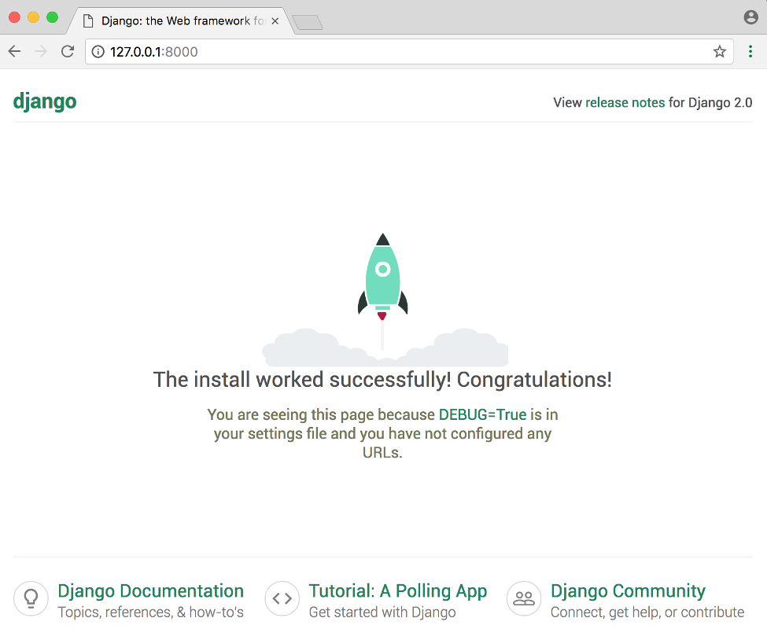

#### Git and Visual Studio Code

```bash
$ sudo apt install git # git is by default installed in linux based system

# two additional commands for newly installed git
$ git config --global user.name "Your Name"
$ git config --global user.email "yourname@email.com"
```

**Editor**:

- `Visual Studio Code` is awesome.

```bash
$ sudo snap install --classic code
```

- Experienced programmer used `vim` or `emacs`

#### Hello World Application

This is the `traditional` way to start a new programming language or `framework`. We’ll also work with `git` for the first time and deploy our code to `Github`.

- **Initial Setup**:

To start navigate to a new directory on your computer. For example, we can create a
helloworld folder on the Desktop with the following commands.
Command Line

```bash
$ cd ~/projects
$ mkdir helloworld
$ cd helloworld
```

Make sure you’re not already in an `existing virtual environment` at this point. If you see
text in parentheses () before the dollar sign $ then you are. To exit it, type exit and
hit Return . The parentheses should disappear which means that virtual environment
is no longer active.

We’ll use pipenv to `create a new virtual environment`, install `Django` and then activate
it.

```bash
# install django
$ pipenv install django
# activate environment
$ pipenv shell
# create helloworld_project
$ django-admin startproject helloworld_project .
$ tree
.
├── helloworld_project
│   ├── asgi.py
│   ├── __init__.py
│   ├── settings.py
│   ├── urls.py
│   └── wsgi.py
├── manage.py
├── Pipfile
└── Pipfile.lock
```

The

- `settings.py` file controls our **project’s settings**
- `urls.py` tells Django which pages to build in response to a browser or url request,
- `wsgi.py` which stands for **web server gateway interface**, helps Django serve our eventual web pages.
- The last file `manage.py` is used to execute various Django commands such as running the local web
  server or creating a new app.

Django comes with a built-in web server for local development purposes. We can start
it with the `runserver` command.

```bash
$ ls
helloworld_project  manage.py  Pipfile  Pipfile.lock
$ python manage.py runserver
```

#### Create an app

Django uses the concept of `projects and apps` to keep code `clean and readable`. A
**single Django project contains one or more apps within it that all work together to power a web application**. This is why the command for a new Django project is
**startproject** ! For example, a real-world Django `e-commerce` site might have one app
for user `authentication`, another app for `payments`, and a third app to power item
`listing` details. Each focuses on an isolated piece of functionality.

We need to create our **first app** which we’ll call `pages` . From the command line, quit
the server with `Control+c` . Then use the startapp command.

```bash
$ python manage.py startapp pages
$ tree
pages/
├── admin.py
├── apps.py
├── __init__.py
├── migrations
│   └── __init__.py
├── models.py
├── tests.py
└── views.py
```

Let’s review what each new pages app file does:

- `admin.py` is a configuration file for the built-in Django Admin app.
- `apps.py` is a configuration file for the app itself.
- `migrations/` keeps track of any changes to our `models.py` file so our database
  and `models.py stay in sync`.
- `models.py` is where we define our **database** models, which Django automatically
  translates into database tables.
- `tests.py` is for our app-specific tests.
- `views.py` is where we handle the `request/response logic` for our web app.

Even though our `new app exists within the Django project`, Django doesn’t “know”
about it until we **explicitly add** it. In your text editor open the `settings.py` file and
scroll down to **INSTALLED_APPS** where you’ll see six built-in Django apps already there.
Add our new pages app at the bottom:

```py
# helloworld_project/settings.py
INSTALLED_APPS = [
    'django.contrib.admin',
    'django.contrib.auth',
    'django.contrib.contenttypes',
    'django.contrib.sessions',
    'django.contrib.messages',
    'django.contrib.staticfiles',
    'pages', # new
]
```

#### Views and URLConfs

In Django,

- `Views` determine what `content is displayed` on a given page while
- `URLConfs` determine `where that content is going`.

When a user **requests** a specific page, like the homepage, the **URLConf** uses a `regular expression to map that request to the appropriate view function which then returns the correct data.`

In other words, our view will output the text “Hello, World” while our url will ensure
that when the user visits the homepage they are redirected to the correct view.
Let’s start by updating the views.py file in our pages app to look as follows:

```py
# pages/views.py
from django.http import HttpResponse

def homePageView(request):
    return HttpResponse('Hello, World!')
```

Basically we’re saying whenever the view function **homePageView** is called, return
the text `“Hello, World!”` More specifically, we’ve imported the built-in `HttpResponse method so we can return a response object to the user`. We’ve created a function called
homePageView that accepts the request object and returns a response with the string
Hello, World! .

Now we need to configure our `urls.py` Within the pages app, **create** a new `urls.py` file.

```bash
$ ls
db.sqlite3  helloworld_project	manage.py  pages  Pipfile  Pipfile.lock
$ cd pages
$ ls
admin.py  apps.py  __init__.py	migrations  models.py  tests.py  views.py
$ touch urls.py
$ ls
admin.py  apps.py  __init__.py	migrations  models.py  tests.py  views.py urls.py # new
```

Code:

```py
# pages/urls.py
from django.urls import path
from . import views

urlpatterns = [
    path('', views.HomePageView, name='home'),
]
```

On the top line we `import path` from Django to power our **urlpattern** and on the next
line we import our views. The period used here `from . import views` means reference
the `current directory`, which is our pages app containing both views.py and urls.py .
Our urlpattern has three parts:

```py
    path('regular expression', view, name=optional),
```

- a Python regular expression for the empty string ''
- specify the view which is called homePageView
- add an optional url name of 'home'

> In other words, if the user requests the homepage, represented by the empty string '' then use the view called homePageView .

We’re almost done. The last step is to configure our project-level `urls.py` file too.
Remember that it’s common to have multiple apps within a single Django project, so
they each need their own route.

Update the helloworld_project/urls.py file as follows:

```py
# helloworld_project/urls.py
from django.contrib import admin
from django.urls import path, include

urlpatterns = [
    path('admin/', admin.site.urls),
    path('', include('pages.urls')),
]
```

It’s often confusing to beginners that we don’t need to import the pages app here, yet
we refer to it in our urlpattern as pages.urls . The reason we do it this way is that that
the method `django.urls.include()` expects us to pass in a **module**, or **app**, as the `first argument`. So without using include we would need to import our pages app, but since
we do use include we don’t have to at the project level!

We have all the code we need now! To confirm everything works as expected, restart
our Django server:

```bash
$ ls
db.sqlite3  helloworld_project	manage.py  pages  Pipfile  Pipfile.lock
$ python manage.py runserver
# ...........
Django version 3.2.3, using settings 'helloworld_project.settings'
Starting development server at http://127.0.0.1:8000/
Quit the server with CONTROL-C.
```

If you visit [http://127.0.0.1:8000/](http://127.0.0.1:8000/) you should see the following image.
Starting development server at http://127.0.0.1:8000/.

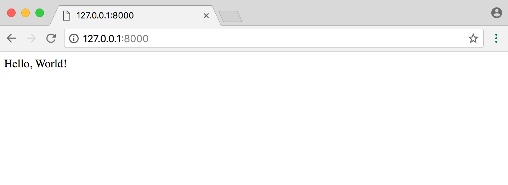

#### Deploy on Github

```bash
$ git init
$ git status
# .... some output ......
$ git add --all
# .... some output ......
$ git commit -m 'initial message'
# .... some output ......
$ git push
```

#### Pages App

Here we’ll **build**, **test**, and **deploy** a Pages app that has a `homepage` and an
`about` page. Later We’ll also learn about Django’s **class-based views** and **templates** which are
the building blocks for the more complex web applications built later on this README.md file.

The whole task we done before here...

```bash
$ cd ~/Desktop
$ mkdir pages
$ cd pages
$ pipenv install django
$ pipenv shell
(pages) $ django-admin startproject pages_project .
(pages) $ python manage.py startapp pages
```

Update `helloworld_project/settings.py` and run a **runserver** command and we see the output like that:


#### Templates

**App Level**:

Every web framework needs a convenient way to `generate HTML files`. In Django, the approach is to use templates so that individual HTML files can be served by a view to a web page specified by the **URL**.

It’s worth repeating this pattern since you’ll see it over and over again in Django
development: **Templates, Views, and URLs**. The order in which you create them
doesn’t much matter since all three are required and work closely together.

- The `URLs` control the `initial route`, the `entry point into a page, such as /about` ,
- The `views` contain the `logic` or the “what”, and
- The `template` has the `HTML`.

For web pages that rely on a **database model**, it is the view that does much of the work to decide what data is
available to the template.

So: `Templates, Views, URLs`. This pattern will hold true for every Django web page
you make. However it will take some repetition before you internalize it.
Ok, moving on.

The question of where to place the templates directory can be
confusing for beginners. By default, Django looks within each app for templates. In our
pages app it will expect a index.html template to be located in the following location:

```bash
$ mkdir templates/pages
$ touch templates/pages/index.html

$ tree templates/
templates/
└── pages
    └── index.html
```

This means we would need to create a new templates directory, a new directory with
the name of the app, pages , and finally our template itself which is index.html .
A common question is: Why this repetitive structure? The short answer is that the
Django template loader wants to be really sure it find the correct template and this is
how it’s programmed to look for them.

```html
<!-- pages/index.html -->
<h1>Index Pages</h1>
```

**Project Level**:

And that is to instead create a single, project-level templates directory
that is available to all apps.

This is the approach we’ll use. By making a small tweak to our settings.py file we can tell Django to also look in this project-level folder for templates.

```bash
$ ls
db.sqlite3  helloworld_project	manage.py  pages  Pipfile  Pipfile.lock
$ mkdir templates
$ touch templates/home.html
$ ls
db.sqlite3  helloworld_project	manage.py  pages  Pipfile  Pipfile.lock  templates
$ ls templates
home.html
```

Next we need to update settings.py to tell Django to look at the project-level for
templates. This is a one-line change to the setting 'DIRS' under TEMPLATES .
Code

```py
# pages_project/settings.py
TEMPLATES = [
    {
    # ...
        'DIRS': [os.path.join(BASE_DIR, 'templates')],
    # ...
    },
]
```

Then we can add a simple headline to our `home.html` file.

```html
<!-- templates/home.html -->
<h1>Homepage.</h1>
```

Ok, our **template is complete**! The next step is to configure our **url** and **view**.

#### Class-Based View

Early versions of Django only shipped with function-based views, but developers soon
found themselves repeating the same patterns over and over again. Write a view that
lists all objects in a model. Write a view that displays only one detailed item from a
model. And so on.

Function-based generic views were introduced to abstract these patterns and stream-
line development of common patterns. However `there was no easy way to extend or customize these views`.
As a result, Django introduced `class-based generic views` that
make it easy to use and also extend views covering common use cases.

In our view we’ll use the built-in **TemplateView** to `display` our **template**. Update the
`pages/views.py` file.

```py
# pages/views.py
from django.views.generic import TemplateView

# Using project level templates
class HomePageView(TemplateView):
    # must defined "template_name"
    template_name = 'home.html'

# using app level templates
class IndexPageView(TemplateView):
    template_name = 'pages/index.html'
```

Note that we’ve capitalized our view since it’s now a Python class. Classes, unlike
functions, should always be capitalized. The **TemplateView** already contains all the
logic needed to display our template, we just need to specify the **template’s name**.

#### URLs

The last step is to update our **URLConfs**. Recall from Chapter 2 that we need to make
updates in `two locations`. First we update the project-level urls.py file to point at our
pages app and then within pages we match the views to routes.

Let’s start with the `project-level urls.py` file.

```py
# pages_project/urls.py
from django.contrib import admin
from django.urls import path, include

urlpatterns = [
    path('admin/', admin.site.urls),
    path('', include('pages.urls')),
]
```

Secondly edit the `pages/urls.py` file.

```py
# pages/urls.py
from django.urls import path
from . import views

urlpatterns = [
    # for class based view use .as_view()
    path('', views.HomePageView.as_view(), name='home'),
    path('', views.IndexPageView.as_view(), name='index'),
]
```

This pattern is almost identical to what we did in Chapter 2 with one major difference.
When using Class-Based Views, `you always add as_view() at the end of the view name`.
And we’re done! If you start up the web server with python manage.py runserver and
navigate to http://127.0.0.1:8000/home/ you can see our new homepage. And
navigate to http://127.0.0.1:8000/index/ you can see our new new index page.

```bash
$ python manage.py runserver
```

**Note**:

If we create same name template file like home.html in two different place.

> `project/templates/pages/home.html` and `app/templates/pages/home.html` then ... **project-level** `home.html` template is called.

> If `project level` template is **deleted** then `application level` template is called.

#### Extending Templates

The real power of templates is their `ability to be extended`. If you think about most web
sites, there is content that is repeated on every page (**header**, **footer**, etc). Wouldn’t it
be nice if we, as developers, could have one canonical place for our header code that
would be inherited by all other templates?

Well we can! Let’s create a `base.html` file containing a header with links to our two
pages.

```bash
$ touch templates/base.html
```

Django has a minimal templating language for adding links and basic logic in our
templates. You can see the full list of built-in template tags here in the official
docs. Template tags take the form of `` where the “something” is the
template tag itself. You can even create your own **custom template** tags.

To add URL links in our project we can use the built-in url template tag which takes
the URL pattern name as an argument. Remember how we added `optional URL names to our url routers`?
This is why. The url tag uses these names to automatically create links for us.
The URL route for our homepage is called home therefore to configure a link to it we
would use the following: `` .

```html
<!-- templates/base.html -->
<header>
  <a href="">Home</a> | <a href="">Index</a>
</header>

<!-- block content are inherited by child template -->

<!-- child template code -->

```

At the bottom we’ve added a block tag called content . Blocks can be overwritten by
child templates via inheritance.

> **Note**: You can create multiple content block in one single template.

Let’s update our `home.html` and `index.html` to extend the base.html template. That
means we can reuse the same code from one template in another template. The
Django templating language comes with an extends method that we can use for this.

```html
<!-- apps/templates/app/index.html -->
 
<h1>pages/index.html</h1>

```

and,

```html
<!-- project/templates/home.html -->
 
<h1>pages/index.html</h1>

```

Now if you start up the server with python manage.py runserver and open up our
webpages again at http://127.0.0.1:8000/ and http://127.0.0.1:8000/about you’ll see
the header is magically included in both locations.

Nice, right?

|                               |                              |
| ----------------------------- | ---------------------------- |
| 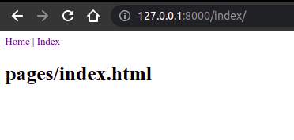 | 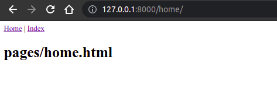 |

#### Tests

Finally we come to tests. Even in an application this basic, it’s important to add tests
and get in the habit of always adding them to our Django projects. In the words of
**Jacob Kaplan-Moss**, one of Django’s original creators, **“Code without tests is broken as designed.”**

Writing tests is important because it automates the process of confirming that the
code works as expected. In an app like this one, we can manually look and see that
the home page and about page exist and contain the intended content. But as a Django project grows in size there can be hundreds if not thousands of individual web pages
and the idea of manually going throw each page is not possible. Further, whenever
we make changes to the code–adding new features, updating existing ones, deleting
unused areas of the site–we want to be sure that we have not inadvertently broken
some other piece of the site. Automated tests let us write one time how we expect a
specific piece of our project to behave and then let the computer do the checking for
us.

Fortunately Django comes with robust, `built-in testing tools` for writing and running
tests.
If you look within our pages app, Django already provided a `tests.py` file we can use.

Open it and add the following code:

```py
from django.http import response
from django.test import TestCase, SimpleTestCase


# Create your tests here.
class SimpleTest(SimpleTestCase):
    def test_home_page_status_code(self):
        response = self.client.get('/home/')
        self.assertEqual(response.status_code, 200)

    def test_index_page_status_code(self):
        response = self.client.get("/index/")
        self.assertEqual(response.status_code, 200)
```

We’re using `SimpleTestCase` here since we `aren’t using a database`. If we were using
a `database`, we’d instead use `TestCase`. Then we perform a check if the status code for each page is 200, which is the standard response for a successful HTTP request.
That’s a fancy way of saying it ensures that a given webpage actually exists, but says
nothing about the content of said page.

To run the tests quit the server Control-c and type `python manage.py test` on the
command line:

```bash
$ python manage.py test
System check identified no issues (0 silenced).
..
----------------------------------------------------------------------
Ran 2 tests in 0.016s

OK
```

Success! We’ll do much more with `testing in the future, especially once we start working with databases`.
For now, it’s important to see how easy it is to add tests
each and every time we add new functionality to our Django project.

```bash
$ git add --all && git commit -m 'view template and test' && git push
```

#### Local vs Production

Up to this point we’ve been using Django’s own internal web server to power our
Pages application locally on our computer. But you can’t share a localhost address
with someone else. To make our site available on the Internet where everyone can
see it, we need to **deploy our code to an external server** that anyone can use to see
our site. This is called putting our code into production. Local code lives only on our
computer; production code lives on an external server.
There are many server providers available but we will use **Heroku** because it is free for
small projects, widely-used, and has a relatively straightforward deployment process.

#### Sign Up in Heroku and Login in Heroku CLI

Go [Heroku](www.heroku.com)

CLI Install and Login

```bash
$ sudo snap install heroku
$ heroku login
# .....log in from CLI or using browser.
```

#### Additional Files

We need to make the following four changes to our Pages project so it’s ready to deploy
online with Heroku:

- update `Pipfile.lock`
- make a new `Procfile` file
- install `gunicorn` as our web server
- make a `one-line change` to `settings.py` file

Within your existing Pipfile specify the version of Python we’re using, which is . .
Add these two lines at the bottom of the file.

```text
# Pipfile
[requires]
python_version = "3.8"
```

Then run pipenv lock to generate the appropriate Pipfile.lock .

```bash
$ pipenv lock
```

Heroku actually `looks` in our `Pipfile.lock` for information on our `virtual environment`,
which is why we add the language setting here.

Next create a **Procfile** which is specific to Heroku.

```bash
$ touch Procfile
```

Open the **Procfile** with your text editor and add the following:

```py
web: gunicorn helloworld.wsgi --log-file -
```

This says to use our existing `helloworld.wsgi` file but with **gunicorn**, `which is a web server suitable for production`, instead of Django’s own server which is only suitable
for local development.

```bash
$ pipenv install gunicorn
```

The final step is a one-line change to `settings.py` . Scroll down to the section called
**ALLOWED_HOSTS** and add a `'*'` so it looks as follows:

```py
# pages_project/settings.py
ALLOWED_HOSTS = ['*']
```

Then finally add all modified and new files in github...

```bash
$ git add --all && git commit -m 'new updates for heroku deployment' && git push
```

#### Deploy

- create a new app on Heroku and push our code to it
- add a git remote “hook” for Heroku
- configure the app to ignore static files, which we’ll cover in later chapters
- start the Heroku server so the app is live
- visit the app on Heroku’s provided URL

**Step-1**:

We can do the first step, creating a new Heroku app, from the command line with
heroku create . Heroku will create a random name for our app, in my case `cryptic-oasis-4343`.
Your name will be different.

```bash
$ heroku create
# .................. creating app names cryptic-oasis-4343
```

Now we need to add a “hook” for Heroku within git. This means that git will store
both our settings for pushing code to Bitbucket and to Heroku.

```bash
# heroku git:remote -a app_name
$ heroku git:remote -a cryptic-oasis-4343
```

We only need to do one set of Heroku **configurations** at this point, which is to tell
Heroku to `ignore static files like CSS and JavaScript` which Django by default tries to
optimize for us. We’ll cover this in later chapters so for now just run the following
command.

```bash
$ heroku config:set DISABLE_COLLECTSTATIC=1
```

Now we can push our code to Heroku. Because we set our “hook” previously, it will go
to Heroku.

```bash
$ git push origin master
```

If we just typed git push origin master then the code is pushed to **Bitbucket**, not
**Heroku**.

Finally we need to make our Heroku app live. As websites grow in traffic they need
additional Heroku services but for our basic example we can use the lowest level,
`web=1` , which also happens to be free!

Type the following command.

```bash
$ heroku ps:scale web=1
```

We’re done! The last step is to confirm our app is live and online. If you use the
command heroku open your web browser will open a new tab with the URL of your
app:

```bash
$ heroku open
```

Mine is at https://cryptic-oasis-40349.herokuapp.com/about/. You can see both the
homepage and about page are up now.

|                           |                           |
| ------------------------- | ------------------------- |
| 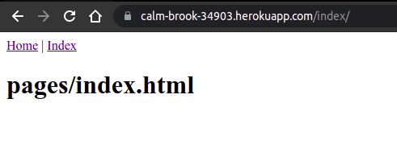 | 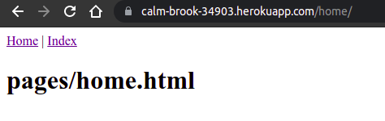 |

```bash
$ heroku login # login to heroku
$ heroku create # create an application on heroku
$ heroku git:remote -a cryptic-oasis-3334 # cryptic-oasis-3334 is the heroku application name
$ heroku config:set DISABLE_COLLECTSTATIC=1 # 1 true, it ensure there is no static files
$ git add --all && git commit -m 'deploy in heroku' # add and commit files
$ git push heroku master # push to bitbucket
$ heroku ps:scale web=1 # make website live
$ heroku open # open the application
```

#### Message Board app

Django provides built-in support for several types of database backends. With just
a few lines in our settings.py file it can support **PostgreSQL**, **MySQL**, **Oracle**, or
**SQLite**. But the simplest–by far–to use is **SQLite** because it runs off a single file and
requires no complex installation.

**Initial Setup**:

- Create a new directory for our code on the Desktop called mb
- Install Django in a new virtual environment
- Create a new project called mb_project
- Create a new app call posts
- Update settings.py

```bash
$ cd ./projects
$ mkdir mb
$ cd mb
$ pipenv install django
$ pipenv shell
$ django-admin startproject mb_project .
$ python manage.py startapp posts
$ vim mb_project/settings.py
# .............
INSTALLED_APPS = [
    'django.contrib.admin',
    'django.contrib.auth',
    'django.contrib.contenttypes',
    'django.contrib.sessions',
    'django.contrib.messages',
    'django.contrib.staticfiles',
    'posts' # new
]
# .............
```

Then execute the migrate command to create an initial database based on Django’s
default settings.

```bash
$ python manage.py migrate
$ ls
db.sqlite3 mb_project manage.py
```

**Aside**: Technically a `db.sqlite` file is created the first time you run either **migrate**
or **runserver** . Using `runserver configures a database using Django’s default settings`,
however **migrate** will sync the database with the current state of any database models
contained in the project and listed in **INSTALLED_APPS** . In other words, to make sure
the database reflects the current state of your project you’ll need to `run migrate` (and
also `makemigrations` ) each time you **update** a model. More on this shortly.
To confirm everything works correctly, spin up our local server.

```bash
$ python manage.py runserver
```

and see the result,


#### Creating a Database Model

Our first task is to create a database model where we can store and display posts
from our users. Django will turn this model into a database table for us. In real-world
Django projects, it’s often the case that there will be many complex, interconnected
database models but in our simple message board app we only need one.

Open the posts/models.py file and We want to create a model to
store the textual content of a message board post.

```py
# posts/models.py

from django.db import models

class Post(models.Model):
    text = models.TextField()
```

Note that we’ve created a new database model called Post which has the database
field text . We’ve also specified the type of content it will hold, TextField() . Django
provides many model fields supporting common types of content such as **characters**,
**dates**, **integers**, **emails**, and so on.

#### Activating Models

Now that our new model is created we need to activate it. Going forward, whenever we
create or modify an existing model we’ll need to update Django in a two-step process.

1. First we create a migration file with the makemigrations command which `generate the SQL commands` for preinstalled apps in our **INSTALLED_APPS** setting.
   Migration files do `not execute` those commands on our database file, rather they
   are a `reference of all new changes` to our models. This approach means that we
   have a record of the changes to our models over time.
1. Second we build the actual database with migrate which does **execute** the
   **instructions in our migrations** file.

```bash
$ python manage.py makemigrations posts # specify the app name is helpful for debugging
$ python manage.py migrate posts
```

Note that you don’t have to include a name after either makemigrations or migrate .
If you simply run the commands then they will apply to all available changes. But it’s
a good habit to be specific. If we had two separate apps in our project, and updated
the models in both, and then ran makemigrations it would generate a migrations file
containing data on both changes. This makes debugging harder in the future. You
want each migration file to be as small and isolated as possible. That way if you need
to look at past migrations, there is only one change per migration rather than one that
applies to multiple apps.

#### Django Admin

Django provides us with a robust admin interface for interacting with our database.
This is a truly killer feature that few web frameworks offer. It has its routes in
Django’s origin as a project at a newspaper. The developers wanted a CMS (Content
Management System) so that journalists could write and edit their stories without
needing to touch “code.” Over time the built-in admin app has evolved into a fantastic,
out-of-the-box tool for managing all aspects of a Django project.

To use the Django admin, we first need to create a superuser who can login. In your
command line console, type python manage.py createsuperuser and respond to the
prompts for a username, email, and password:

```bash
$ python manage.py createsuperuser
name:
email:
password:
# superuser created successfully.
```

Restart the Django server with python manage.py runserver and in your browser go
to http://127.0.0.1:8000/admin/. You should see the admin’s login screen:

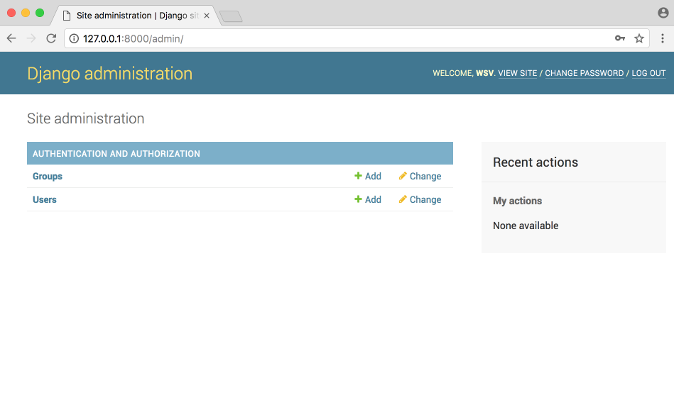

But where’s our posts app? It’s not displayed on the main admin page!
We need to explicitly tell Django what to display in the admin. Fortunately we can
change fix this easily by opening the posts/admin.py file and editing it to look like
this:

```py
# posts/admin.py
from django.contrib import admin
from .models import Post
admin.site.register(Post)
```

- Django now knows that it should display our posts app and its database model Post
  on the admin page. If you refresh your browser you’ll see that it now appears:

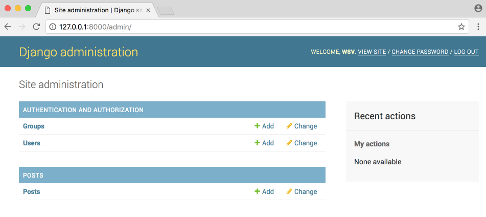

- Now let’s create our first message board post for our database. Click on the + Add
  button opposite Posts . Enter your own text in the Text form field.


- Then click the “Save” button, which will redirect you to the main Post page. However
  if you look closely, there’s a problem: our new entry is called “Post object”, which isn’t
  very helpful.


- Let’s change that. Within the posts/models.py file, add a new function `__str__` as
  follows:

```py
from django.db import models

class Post(models.Model):
    text = models.TextField()

    def __str__(self) -> str: # new portion
        return self.text[:50]
```

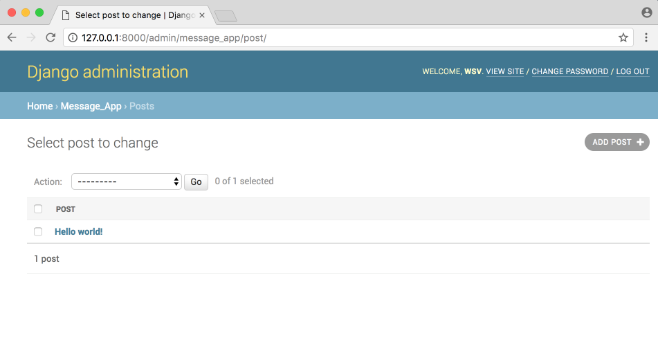

#### Views, Templates and URLs

In order to display our database content on our homepage, we have to wire up our
**views**, **templates**, and **URLConfs**.

Let’s begin with the view. Earlier in the book we used the built-in generic `TemplateView`
to display a template file on our homepage. Now we want to list the contents of
our database model. Fortunately this is also a common task in web development and
Django comes equipped with the generic class-based `ListView`.

In the `posts/views.py` file enter the Python code below:

```py
from django.views.generic import ListView
from . import models

# Create your views here.
class HomePageView(ListView):
    model = models.Post
    template_name = 'posts/home.html'
```

In the first line we’re importing `ListView` and in the second line we need to `explicitly`
define which `model` we’re using. In the view, we subclass `ListView` , specify our `model name`
and specify our `template reference`. Internally `ListView returns an object` called
**object_list** that we want to display in our template.

Our view is complete which means we still need to configure our URLs and make
our template. Let’s start with the template. Create a **project-level directory** called
`templates and a home.html template file`.

```bash
$ mkdir templates/posts/
$ touch templates/posts/home.html
```

Then update the **DIRS** field in our `settings.py` file so that Django knows to look in this
templates folder.

```py
import os
# .......
# settings.py
TEMPLATES = [
    {
    # ...
        'DIRS': [os.path.join(BASE_DIR, 'templates')],
    # ...
    },
]
```

In our templates file `home.html` we can use the Django Templating Language’s for loop
to list all the objects in `object_list` . Remember that object_list is what ListView
returns to us.

```html
<!-- templates/posts/home.html -->
<h1>Message Board Homepage</h1>

<ul>
  
  <li>{{ post }}</li>
  
</ul>
```

The last step is to set up our **URLConfs**. Let’s start with the `project-level` `urls.py` file
where we simply `include` our posts and add include on the second line.

```py
# mb_project/urls.py
from django.contrib import admin
from django.urls import path, include

urlpatterns = [
    path('admin/', admin.site.urls),
    path('', include('posts.urls')),
]
```

Then create an app-level urls.py file.

```bash
$ touch posts/urls.py
```

Then update it look like this,

```py
from django.urls import path
from . import views

urlpatterns = [
    # we need to use as_view for class based view
    path('', views.HomePageView.as_view(), name='home'),
]
```

Then run the server,

```bash
$ python manage.py runserver
```

Restart the server with python manage.py runserver and navigate to our homepage
http://127.0.0.1:8000/ which now lists out our message board posts.

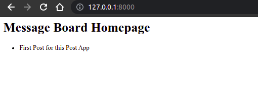

We’re basically done at this point, but `let’s create a few more message board posts` in
the `Django admin` to confirm that they will display correctly on the homepage.

Goto http://127.0.0.1:8000/admin/

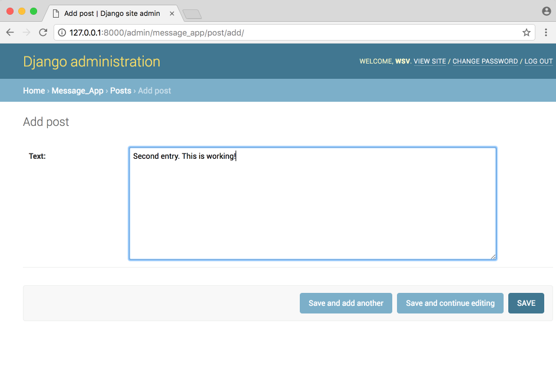

Add some more post and see the output,

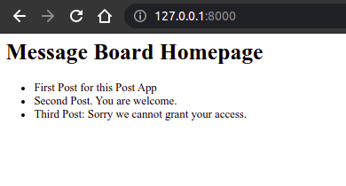

Add all the files into the Github.

```bash
$ git init
$ git add --all
$ git commit -m 'initial commit'
```

#### Adding Test in MB Project

Previously we were only testing **static** pages so we used `SimpleTestCase`. But now that
our homepage works with a **database**, we need to use `TestCase` which will let us create
a `“test” database` we can check against.

> In other words, we don’t need to run tests on our actual database but instead can make a separate test database, fill it with sample data, and then test against it.

Let’s start by adding a sample post to the text database field and then check that it
is stored correctly in the database. It’s **important** that all our `test methods` start with
**test\_** so Django knows to test them! The code will look like this:

```py
from django.test import TestCase
from .models import Post
# Create your tests here.

class PostModelTest(TestCase):

    # not used for test
    def setUp(self):
        # create a simple post, text is our model field
        Post.objects.create(text='just a test')

    # used for test because this method
    # start with "test_something"
    def test_text_content(self):
        post = Post.objects.get(id=1)
        excepted_object_name = f'{post.text}'
        self.assertEqual(excepted_object_name, 'just a test')
```

At the top we import the **TestCase** module which lets us `create a sample database`, then
import our `Post model`. We create a new class `PostModelTest` and add a method `setUp`
to `create a new database` that has just one entry: a post with a text field containing
the string `‘just a test’`.

Then we run our first test, `test_text_content` , to check that the database field actually
contains just a test . We create a variable called post that represents the first id on
our Post model. Remember that Django `automatically sets this id for us`. If we created
another entry it would have an id of 2, the next one would be 3, and so on.

The following line uses `f strings` which are a very cool addition to Python 3.6. They
let us put variables directly in our strings as long as the variables are surrounded by
brackets `{}` . Here we’re setting expected_object_name to be the string of the value in
post.text , which should be just a t
est .

On the final line we use **assertEqual** to check that our newly created entry does in
fact match what we input at the top. Go ahead and run the test on the command line
with `python manage.py test` .

```bash
$python manage.py test
Creating test database for alias 'default'...
System check identified no issues (0 silenced).
.
----------------------------------------------------------------------
Ran 1 test in 0.002s

OK
Destroying test database for alias 'default'...
```

**Congratulations, It passed!**

Don’t worry if the previous explanation felt like information overload.
`That’s natural the first time you start writing tests`, but you’ll soon find that most
tests that you write are actually quite **repetitive**.

Time for our `second test`. The first test was on the model but now we want test our
one and only page: the homepage. Specifically, `we want to test that it exists` (throws
an `HTTP 200 response`), uses the `home` view, and uses the `home.html` template.
We’ll need to add one more **import** at the top for **reverse** and a brand new class
**HomePageViewTest** for our test.

```py
from django.test import TestCase
from .models import Post
from django.urls import reverse

# .....

class HomePageViewTest(TestCase):

    def setUp(self):
        Post.objects.create(text='this is another test')

    def test_view_url_exists_at_proper_location(self):
        print(Post.objects.all())
        resp = self.client.get('/')
        self.assertEqual(resp.status_code, 200)

    def test_view_url_by_name(self):
        # reverse(optional_name) return the
        # actual url, for current situation it is just '/'
        resp = self.client.get(reverse('home'))
        self.assertEqual(resp.status_code, 200)

    def test_view_uses_correct_template(self):
        resp = self.client.get(reverse('home'))
        self.assertEqual(resp.status_code, 200)
        print(resp)
        self.assertTemplateUsed(resp, 'posts/home.html')
```

Let's run `python manage.py test`

```bash
$python manage.py test
Creating test database for alias 'default'...
System check identified no issues (0 silenced).
.<QuerySet [<Post: this is another test>]>
.<TemplateResponse status_code=200, "text/html; charset=utf-8">
..
----------------------------------------------------------------------
Ran 4 tests in 0.018s

OK
Destroying test database for alias 'default'...
```

Why does it say `four tests`? Remember that our setUp methods are not actually tests,
they merely let us run subsequent tests. Our four actual tests are test*text_content ,
test_view_url_exists_at_proper_location , test_view_url_by_name , and test_view*-
uses_correct_template .
Any function that has the word **test\*** at the beginning and exists in a tests.py file will
be run when we execute the command `python manage.py test` .

#### Heroku Configuration and Deploy the Message Book Application

**Configuration**:

We need to make the following changes to our Message Board project to deploy it
online:
- Update `Pipfile.lock` # Using `pipenv lock`
- New `Procfile` # Add `web: gunicorn mb_project.wsgi --log-file -`
- Install `gunicorn` # Using `pipenv install gunicorn`
- Update `settings.py` # Make `ALLOWED_HOST = ['*']`


# Add files into the Github

```bash
$ git init
$ git add --all
$ git commit -m 'new updates for deploy in heroku'
```
**Deploy**:

```bash
$ heroku login
$ heroku create
›   Warning: heroku update available from 7.56.0 to 7.56.1.
Creating app... done, ⬢ murmuring-caverns-56652
https://murmuring-caverns-56652.herokuapp.com/ | https://git.heroku.com/murmuring-caverns-56652.git
# heroku git:remote -a app_name
$ heroku git:remote -a murmuring-caverns-56652
# disable collectstatic(because we have no static files) that makes our site faster
$ heroku config:set DISABLE_COLLECTSTATIC=1
# push files
$ git push heroku master
# make it live
$ heroku ps:scale web=1
# open the application in browsers
$ heroku open
```

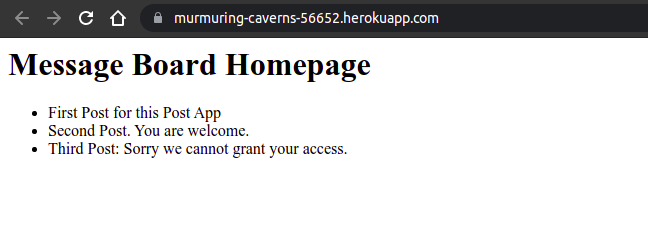

#### Blog App