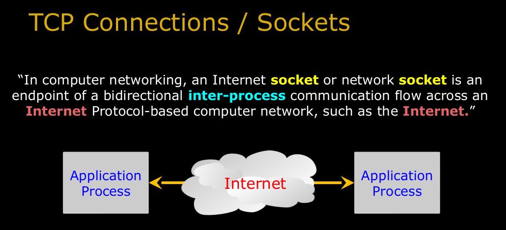

# Web Application Technologies and Django

## Table of Contents

- [Web Application Technologies and Django](#web-application-technologies-and-django)
  - [Table of Contents](#table-of-contents)
    - [Introduction to Dynamic Web Content](#introduction-to-dynamic-web-content)
      - [Network Sockets and Connections](#network-sockets-and-connections)
      - [HyperText Transfer Protocol](#hypertext-transfer-protocol)
      - [Building a very Simple Web Browser in Python](#building-a-very-simple-web-browser-in-python)
      - [Building a Simple HTTP Server and Web Client in Python](#building-a-simple-http-server-and-web-client-in-python)
    - [Installing Django on PythonAnywhere](#installing-django-on-pythonanywhere)
      - [Installing Django on PythonAnywhere](#installing-django-on-pythonanywhere-1)
    - [Hypertext Markup Language](#hypertext-markup-language)

### Introduction to Dynamic Web Content


#### Network Sockets and Connections



**TCP Port Numbers**:

- A **port** is an `application-specific` or `process-specific` software communications **endpoint**.
- It allows `multiple` networked applications to **coexist** on the same server.
- There is a list of well-known TCP port numbers

| Service             | Port Number |
| :------------------ | ----------- |
| `Incoming E-Mail`   | `25`        |
| `Login`             | `23`        |
| `Web Server`        | `80`        |
| `Web Server`        | `443`       |
| `Personal Mail Box` | `109`       |
| `Personal Mail Box` | `110`       |

#### HyperText Transfer Protocol

HyperText Transfer Protocol(**HTTP**) is the `protocol` that **browsers** use to talk to **servers**.


Other Protocol:

- ftp://
- mailto://


[List of Network Protocol](https://en.wikipedia.org/wiki/Lists_of_network_protocols)

**HTTP Protocol**:

- The dominant Application Layer Protocol on the Internet
- Invented for the **Web** - to retrieve HTML, Images, Documents, etc.
- Extended to handle data in addition to documents - RSS, Web Services, etc.
- Basic Concept: `Make a connection - Request a document - Retrieve the document - Close the connection`
- Internet and sockets were created in the 1970's, HTTP was invented in 1990 and is an application protocol that runs atop sockets.

**Making an HTTP Request**:

- Connect to the server like data.pr4e.org
- - a `“handshake”`
- Request a document
- GET http://data.pr4e.org/page1.htm HTTP/1.0
- GET http://www.mlive.com/ann-arbor/ HTTP/1.0
- GET http://www.facebook.com HTTP/1.0


#### Building a very Simple Web Browser in Python

1. **Import** library

Sockets are `built` into Python. It's very cool and it's very simple. So sockets kind of function like `files`, but they're files that we can `send` data to and `receive` data to. But when you're using a file in Python, you've got to first **open** it.

```py
import socket
```

2. **Create** a socket

```py
# Something like make a phone.
mysocket = socket.socket(socket.AF_INET, socket.SOCK_STREAM)
```

3. **Connect** the socket

```py
# dialing the phone to a domain name
# domain name and a port of this domain name
try:
    mysocket.connect(('data.pr4e.org', 80))
except:
    print("Connection failed(maybe domain name is not correct).")
```

4. **Request**

**Why we need to `encode()`**:

And then you have to use encode. And encode means that the data sent across the Internet is generally sent in what's called `UTF-8`. Inside of Python, the data is in `Unicode`, so that you can put literally any character in a Python string. And then preparing it to send it out across the Internet, we encode it into the more dense, more compressed UTF-8 format, rather than we don't send strings across the Internet in Unicode in general.

Now remember I said that you can `simultaneously send and receive on these sockets`. But the `protocol` tells us whether the `first thing we're supposed to do is listen or talk`. `And we're the browser in this case, and so we're supposed to talk first. So we send the request out.`

```py
# request url
cmd = 'GET http://data.pr4e.org/page1.htm HTTP/1.0\r\n\r\n'.encode()
# send request
mysocket.send(cmd)
```

5. **Read** or Retrieve **Data**

The next part of this is we're going to have a little loop. So the `protocol` tells us we're supposed to receive data `until the socket's closed`.

```py
while True:
    data = mysocket.recv(512)
    if len(data) < 1:
        break
    print(data.decode(), end='')

mysocket.close()
```

#### Building a Simple HTTP Server and Web Client in Python

**Server**:

So we're going to make a function called `create_server` that we're going to call right down here, and it's going to print out how you're suppose to access it and then start the server. Now the whole idea of the server is that the server is woke up to wait for incoming connections. So the server already exists. So when you start talking to a web server, that server is in that computer already. The server software is already **running**, **registering** its interest in `incoming requests`. So that's what we do. So when this Python program starts, it's going to sit there and wait in an infinite loop for incoming requests.

```py
import socket

def create_server(port=5500):
    # So the first thing we do is we're going to make a socket.
    # It's an endpoint. It's not actually making the phone call.
    # Remember, I said this socket call is making the phone.

    # simply making a phone
    server_socket = socket.socket(socket.AF_INET, socket.SOCK_STREAM)

    try:
        # I am willing on port 9000 to receive the phone calls.
        server_socket.bind(('localhost', 9000))
        # One application gets the phone calls. The 5 on there says,
        # "Dear operating system, if I'm busy handling one phone call, you can hold
        # on to four more and queue them and then I'll come back and get them for you."
        # That you're asking the operating system to queue incoming calls.
        # Don't just say you're busy, shut down.
        server_socket.listen(5)

        while True:
            # Receive the phone call
            (client_socket, address) = server_socket.accept()

            # read data and decode it utf-8 to unicode
            read_data = client_socket.recv(5000).decode()
            pieces = read_data.split('\n')

            if len(pieces) > 0:
                print(pieces[0])

            # header data
            data = "HTTP/1.1 200 OK\r\n"
            data += "Content-Type: text/html; charset=utf-8\r\n"
            data += "\r\n"
            data += "<html><body>Hello World</body></html>\r\n\r\n"

            # send it to client
            client_socket.sendall(data.encode())
            client_socket.shutdown(socket.SHUT_WR)

    except KeyboardInterrupt:
        print('\nShuting Down\n')
    except Exception as e:
        print("\nError:\n")
        print(e)

    server_socket.close()
print("Access on http://localhost:9000")
create_server()
```

**Web Client**:

```py
import socket
import sys

mysocket = socket.socket(socket.AF_INET, socket.SOCK_STREAM)

try:
    mysocket.connect(('127.0.0.1', 9000))
except socket.error as e:
    print(e)
    sys.exit()

cmd = 'GET http://127.0.0.1/romeo.txt HTTP/1.0\r\n\r\n'.encode()
mysocket.send(cmd)

while True:
    data = mysocket.recv(512)
    if len(data) < 1:
        break
    print(data.decode(), end='')

mysocket.close()
```

### Installing Django on PythonAnywhere

The following materials may be helpful to you as you review this week's lectures and content.

- The [PythonAnywhere](https://www.pythonanywhere.com/user/DevCoders/) website will be used throughout the course to build out web sites and submit them for grading.
- You will use this [Writing Your First Django App, Part I](https://docs.djangoproject.com/en/3.0/intro/tutorial01/) tutorial from Django's documentation to complete the assignment and some quiz answers may also come from this site.

**Resources you might find useful / interesting**:

- [Following the official Django Tutorial on PythonAnywhere](https://help.pythonanywhere.com/pages/FollowingTheDjangoTutorial/) serves as a companion guide to the previous tutorial. This tutorial is for Django 2 and the course uses Django 3 - but the process to install is similar and there is some useful information on this page.

#### Installing Django on PythonAnywhere

**Install** and **setting** up **[PythonAnywhere](https://www.dj4e.com/assn/dj4e_install.md)**

### Hypertext Markup Language

| Tag                | Example                                               |
| ------------------ | ----------------------------------------------------- |
| Heading            | `<h1> This is heading tag.</h1>`                      |
| Paragraph          | `<p> This is a paragraph tag</h1>`                    |
| Linking or Anchor  | `<a href='abs, relative path or url> ... </a>`        |
| Image              | ``               |
| List               | `<ol>`, `<ul>`, `<li>`                                |
| Table              | `<table>`, `<tr>`, `<th>`, `<td>`                     |
| Text formatting    | `<em>`, `<strong>`, `<b>`                             |
| Spacial Character1 | `&lt`, `&gt`, `&amp`, `&pound`, `&euro`, `&yen`       |
| Spacial Character2 | `&sum`, `&forall`, `&isin`, `&larr`, `&rarr`, `&uarr` |
