# Algorithmic Toolbox

## Table of Contents

- [Algorithmic Toolbox](#algorithmic-toolbox)
  - [Table of Contents](#table-of-contents)
    - [Programming Challenges](#programming-challenges)
      - [Prerequisites](#prerequisites)
      - [Sum of Two Digits](#sum-of-two-digits)
      - [Maximum Pairwise Product](#maximum-pairwise-product)
      - [Solving the Maximum Pairwise Product Programming Challenge: Improving the Naive Solution, Testing, Debugging](#solving-the-maximum-pairwise-product-programming-challenge-improving-the-naive-solution-testing-debugging)
    - [Algorithmic Warm-up](#algorithmic-warm-up)
      - [Fibonacci Numbers](#fibonacci-numbers)
      - [Greatest Common Divisors](#greatest-common-divisors)
      - [Big-O Notation](#big-o-notation)
    - [Greedy Algorithms](#greedy-algorithms)
      - [Largest Numbers](#largest-numbers)
      - [Car Fueling](#car-fueling)
      - [Grouping Children](#grouping-children)
      - [Long Hike (Fractional Knapsack)](#long-hike-fractional-knapsack)
    - [Divide-and-Conquer](#divide-and-conquer)
      - [Linear Search](#linear-search)
      - [Binary Search](#binary-search)
      - [Polynomial Multiplication](#polynomial-multiplication)

### Programming Challenges

#### Prerequisites

- Programming Languages(Python, Java, C++) - Any of them.
- [Discrete Mathematics](https://www.coursera.org/learn/what-is-a-proof?specialization=discrete-mathematics)

#### Sum of Two Digits

```py
def main():
    """
        Simple Program that takes two numbers as input and
        return the sum of this two numbers.
        >>> 2 3
        5
        >>> 59 2
        61
    """

    # map(function, iterative)
    nums = list(map(int, input().split()))
    # extract numbers
    a, b = nums

    # return some of two digits
    return a + b


if __name__ == "__main__":
    result = main()
    print(result)
```

#### Maximum Pairwise Product

- **Naive Solution**:

```py
def naive_solution(nums):
    # assume maximum-pairwise-product = 0
    maximum_pairwise_product = 0
    # store total numbers length
    l = len(nums)

    # if num is not empty
    if nums:
        for i in range(l):
            for j in range(i + 1, l):
                if maximum_pairwise_product < nums[i] * nums[j]:
                    maximum_pairwise_product = nums[i] * nums[j]
    else:
        return 0
    return maximum_pairwise_product

def main():
    nums = list(map(int, input().split()))
    maximum_pairwise_product = naive_solution(nums)
    print(maximum_pairwise_product)

if __name__ == "__main__":
    main()
```

But above solution isn't correct. It occur a `Time Limit Error` error. So we need to optimize it.

One optimization is first find the `two maximum numbers` from the array, then return the multiplication of this two numbers.

```py
def optimized_solution(nums):
    l = len(nums)

    # find the first maximum/largest number index
    max_idx1 = -1
    for i in range(l):
        # if index 1 greater than index zero than work
        if (max_idx1 == -1) or (nums[i] > nums[max_idx1]):
            max_idx1 = i

    # find the 2nd maximum/largest number index
    max_idx2 = -1
    for j in range(l):
        # (nums[j] != nums[max_idx1]) -> ensure present number is not equal to past number
        if (nums[j] != nums[max_idx1]) and ((max_idx2 == -1) or nums[j] > nums[max_idx2]):
            max_idx2 = j

    # now return the maximum pairwise product
    return nums[max_idx1] * nums[max_idx2]
```

#### Solving the Maximum Pairwise Product Programming Challenge: Improving the Naive Solution, Testing, Debugging

```py
import random
import heapq

# slow and naive solution
def maximum_pairwise_product(nums):
    maximum_pairwise_product = 0
    if nums:
        for i in range(len(nums)):
            for j in range(i + 1, len(nums)):
                prod = nums[i] * nums[j]
                if maximum_pairwise_product < prod:
                    maximum_pairwise_product = prod
    else:
        return 0
    return maximum_pairwise_product

def optimized_solution(nums):
    """
    l = len(nums)

    # find the first maximum/largest number index
    max_idx1 = -1000
    for i in range(l):
        # if index 1 greater than index zero than work
        if (max_idx1 == -1000) or (nums[i] > nums[max_idx1]):
            max_idx1 = i

    # find the 2nd maximum/largest number index
    max_idx2 = -1000
    for j in range(l):
        # (nums[j] != nums[max_idx1]) -> ensure present number is not equal to past number
        if (nums[j] != nums[max_idx1]) and ((max_idx2 == -1000) or nums[j] > nums[max_idx2]):
            max_idx2 = j

    # now return the maximum pairwise product
    return nums[max_idx1] * nums[max_idx2]
    """

    """
    temp = nums.copy()
    max_1 = max(temp)
    temp.remove(max_1)
    max_2 = max(temp)
    return max_1 * max_2
    """

    """
    nums.sort()
    return nums[-1] * nums[-2]
    """
    # heapq.nlargest(n, iterable) return n largest numbers from the
    # iterable.
    a, b = heapq.nlargest(2, nums)
    return a * b

def main():
    for i in range(50):
        nums = [random.randint(1, 100) for num in range(100)]
        res1 = maximum_pairwise_product(nums)
        res2 = optimized_solution(nums)

        if res1 != res2:
            print(f"Wrong Answer, res1 = {res1} and res2 = {res2}")
        else:
            print("Ok")

if __name__ == "__main__":
    main()
```

### Algorithmic Warm-up

Please Read: `./resources/1-intro-1-whystudyalgorithms.pdf`

#### Fibonacci Numbers

Please Read: `./resources/1-intro-2-fibonaccinumbers.pdf`

```py
import random
import math


def fibonacci_recursive(n):
    if n <= 1:
        return n

    return fibonacci_recursive(n - 1) + fibonacci_recursive(n - 2)


def fibonacci_iterative(n):
    fib = [0, 1]
    for i in range(2, n+1):
        fib.append(fib[i-1]+fib[i-2])

    return fib[n]


def fibonacci_formula(n):
    root_5 = math.sqrt(5.0)

    return (1 / root_5) * ((((1 + root_5) / 2) ** n) - (((1 - root_5) / 2) ** n))


def main():
    # stress test
    for _ in range(10):
        n = random.randint(1, 20)

        recursive = fibonacci_recursive(n)
        iterative = fibonacci_iterative(n)
        method = fibonacci_formula(n - 1)

        print(n, '---->', math.floor(method))

        if recursive != iterative:
            print(
                f'Wrong Answer: recursive = {recursive}, iterative = {iterative}.')
        else:
            print('Ok')


if __name__ == "__main__":
    main()

```

#### Greatest Common Divisors

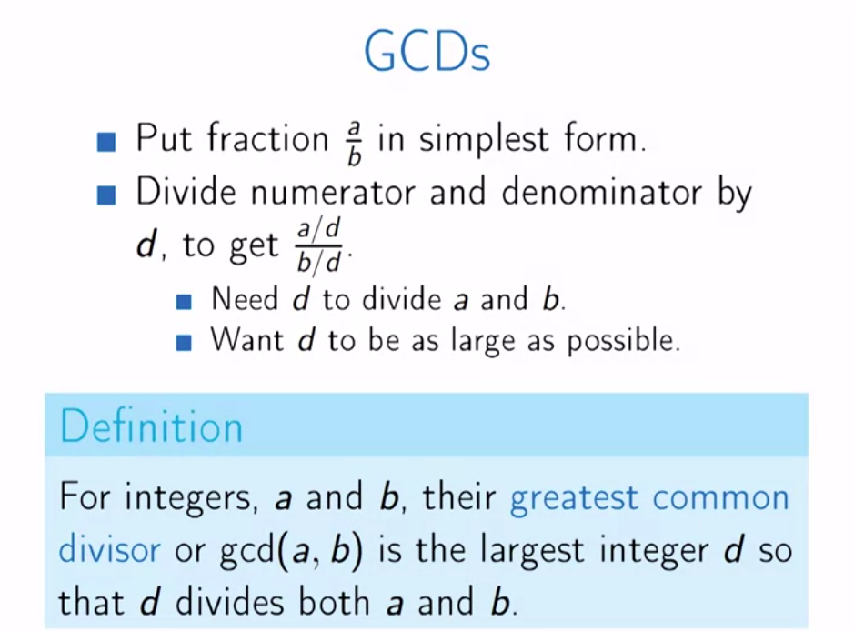

```py
# Naive Algorithm
def gcd_naive(a, b):
    mx = max(a, b)

    gcd = 1
    for i in range(2, mx):
        if a % i == 0 and b % i == 0:
            gcd = i
    return gcd

# GCD Euclid
def gcd_euclid(a, b):
    """
    10) 15 (1
       10
    --------
        5) 10 (2
           10
        --------
            0
    GCD = 5
    """
    if b == 0:
        return a
    else:
        return gcd_euclid(b, a % b)
```

#### Big-O Notation

**Computing Runtimes** `./resources/1-intro-4-1-runtimes.pdf`

**Asymptotic Notation** `./resources/1-intro-4-2-asymptoticnotation1.pdf`

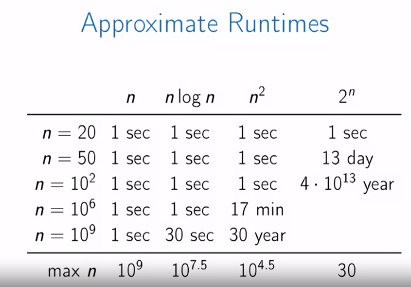

**Big-O Notation**: `./resources/1-intro-4-2-asymptoticnotation2.pdf`

**Using Big-O**: `./resources/1-intro-4-2-asymptoticnotation3.pdf`

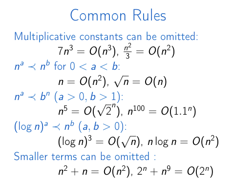

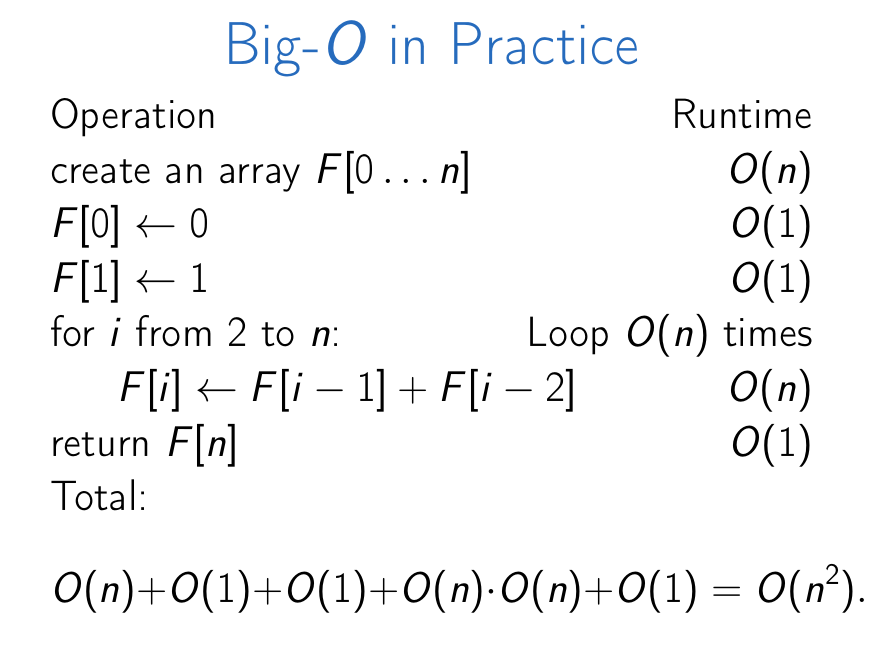

### Greedy Algorithms

#### Largest Numbers

What is the largest number that consists of digits `3, 9, 5, 9, 7, 1`? Use all the digits.

Examples: `359179`, `537991`, `913579`,...

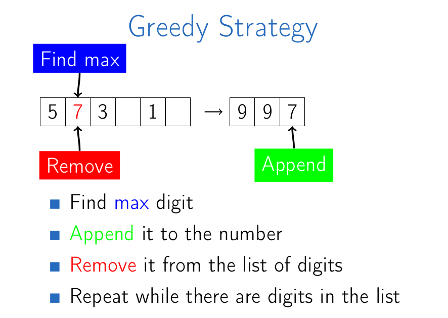

```js
def largest_number_greedy(nums):
    res = []
    for _ in range(len(nums)):
        mx = max(nums)
        res.append(mx)
        nums.remove(mx)
    return ''.join([str(x) for x in res])


def lexicographical_large_number(nums):
    print(nums)
    temp = [str(num) for num in nums]
    res = []

    for _ in range(len(temp)):
        mx = max(temp)
        print(mx)
        res.append(mx)
        temp.remove(mx)
    return res


def main():
    nums = [8, 1, 9, 3, 2]
    large_number = largest_number_greedy(nums.copy())
    print(large_number)
    print(nums)
    large_number = lexicographical_large_number(nums)
    print(large_number)


if __name__ == "__main__":
    main()
```

#### Car Fueling

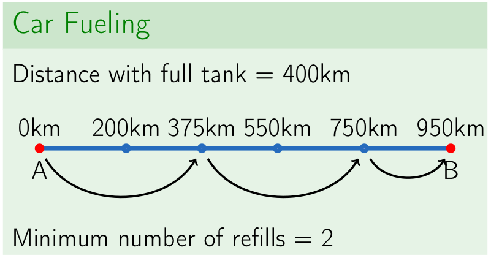

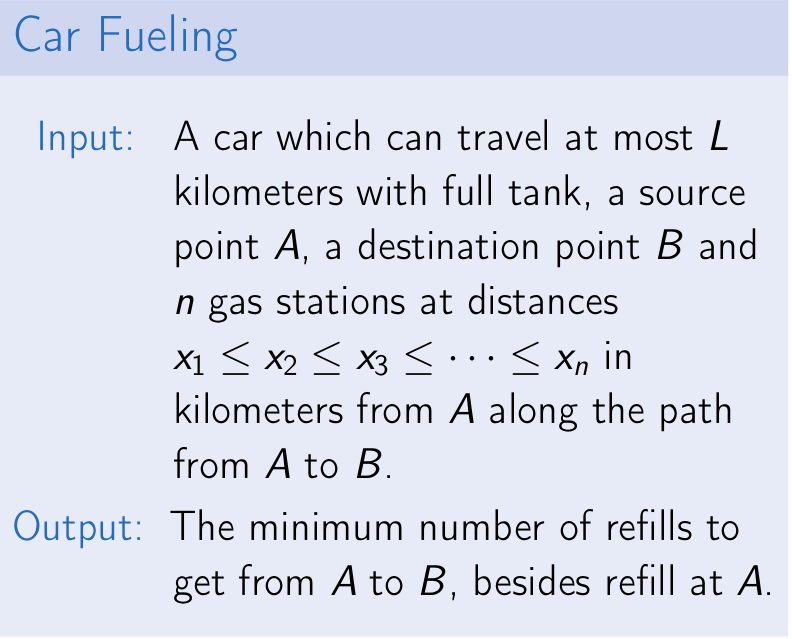

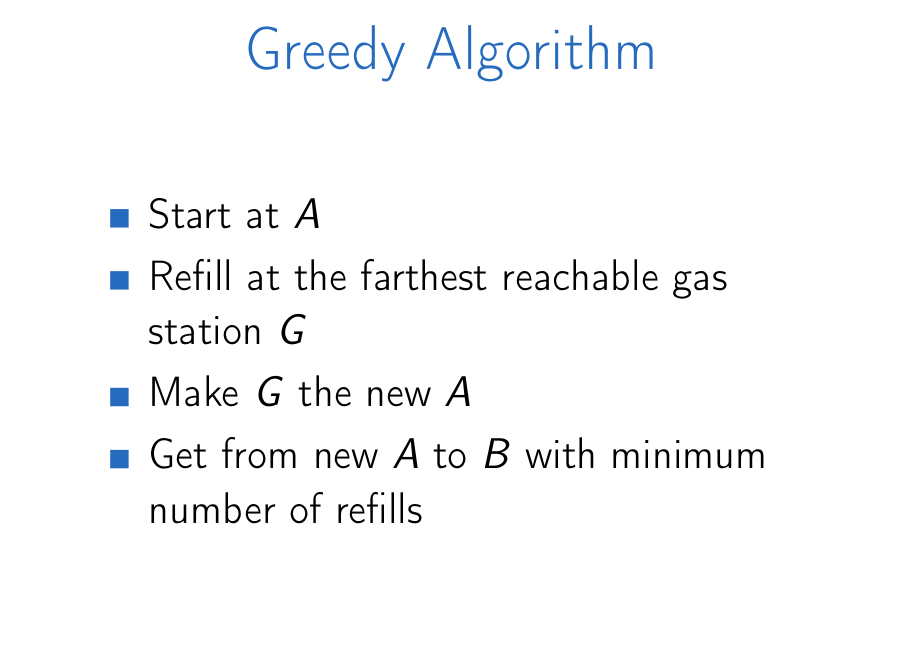

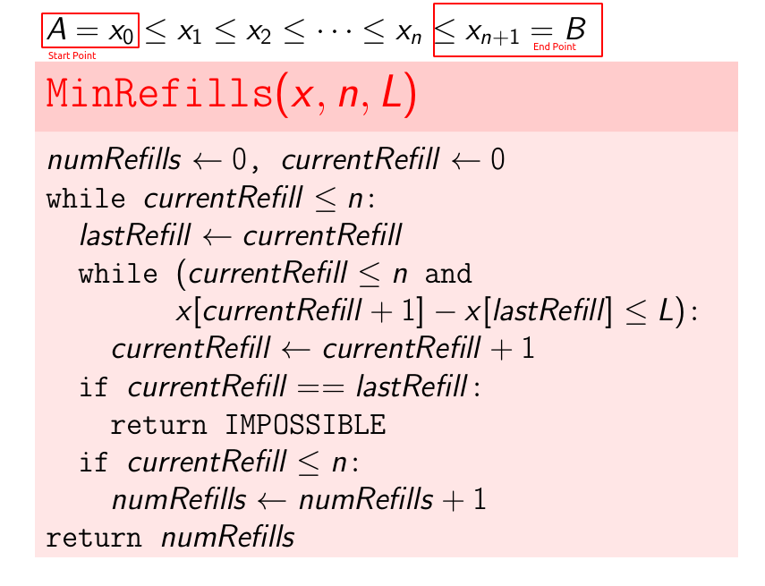

```py
# store the gas station
# here 0 value is the start point
# 200, 375, 550, 750 is the gas station
# 950 is the end point
gas_stations = [0, 200, 375, 550, 750, 950]
# number of miles crossed when it is tank is full
distance_with_full_tank = 400


def min_refills(gas_stations, n, distance_with_full_tank):
    """
        Take the gas stations, number of gas station and distance crossed with full tank
        Return the number of minimum refills and gas station index
    """
    # store current refills
    current_refill = 0
    # store the solution
    nums_of_refills = 0
    gas_stations_idx = []

    # Since current refill is less than gas station number
    while current_refill <= n:
        # make last refill to current refill
        last_refill = current_refill

        while current_refill <= n and gas_stations[current_refill + 1] - gas_stations[last_refill] <= distance_with_full_tank:
            print(gas_stations[current_refill + 1] - gas_stations[last_refill])
            current_refill += 1

        if current_refill == last_refill:
            return "IMPOSABLE"
        if current_refill <= n:
            gas_stations_idx.append(current_refill)
            nums_of_refills += 1

    return nums_of_refills, gas_stations_idx


out = min_refills(gas_stations, len(gas_stations) - 2, distance_with_full_tank)
print(out[1])
```

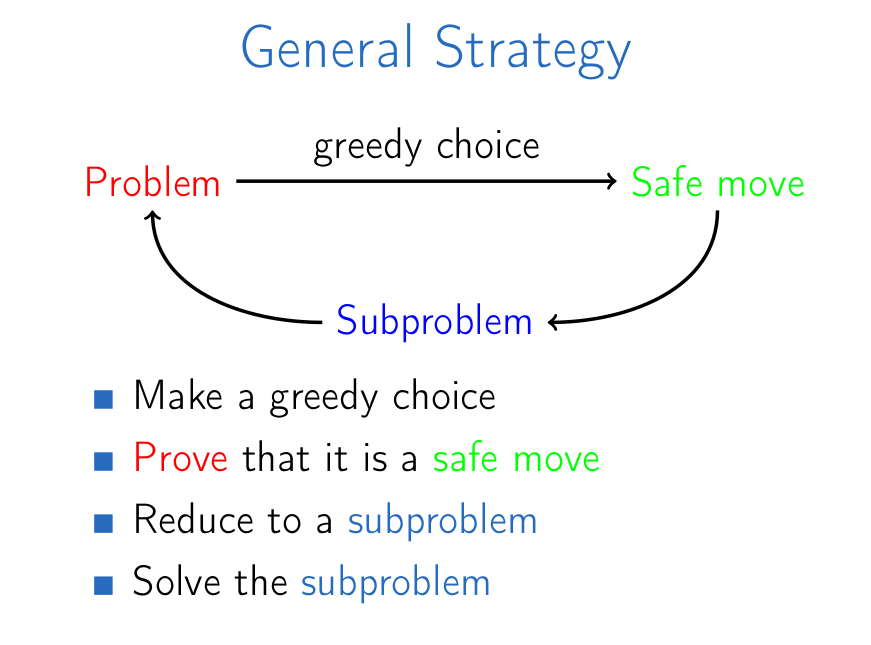

#### Grouping Children

**Problem**: Many children came to a celebration. Organize them into the minimum possible number of groups such that the age of any two children in the same group differ by at most one year.

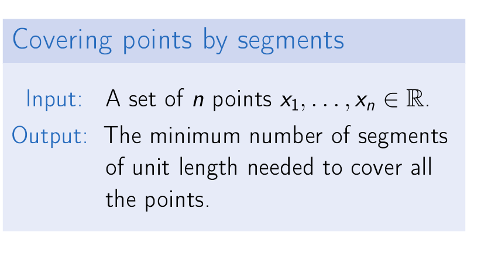
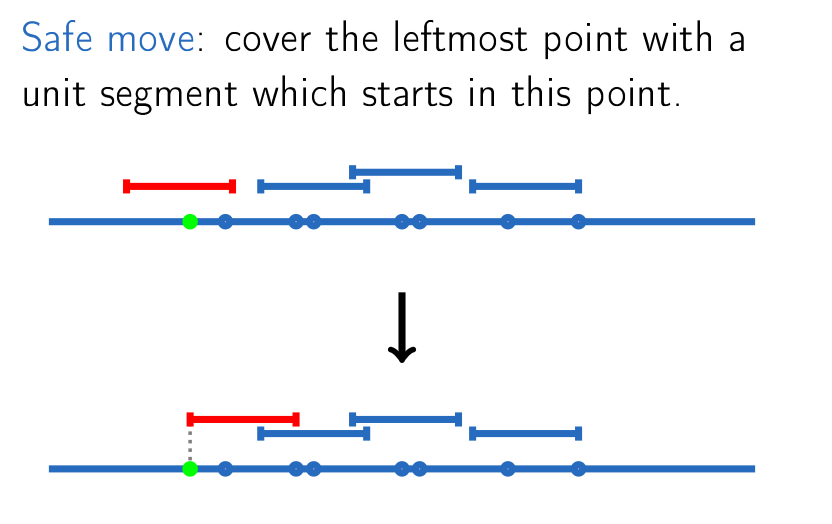

```py
children_ages = [3.2, 3.2, 3.3, 3.8, 4.6, 5.0]

def points_cover_sorted(points: list) -> set:
    """
        Grouping Children:

        For 4 children of ages 3 years 2 months, 3 years 8 months, 4
        years 6 months and 5 years, what is the smallest number of such
        groups that for any two children in the same group their ages
        differ by at most one year?

        We can assume 3 year 2 months => 3.2, 3 year 8 month => 3.8 and
        set it on the line.
                3.2  3.8
        |--------|----|------------------------------------
    """
    points.sort()

    result = []
    i = 0
    while i < len(points):
        point = points[i]
        temp = []
        temp.append(point)
        i += 1
        while i < len(points) and (point + 1.0) >= points[i]:
            temp.append(points[i])
            i += 1
        result.append(temp)
    return result

out = points_cover_sorted(children_ages)
print(out)
print(len(out))
```

#### Long Hike (Fractional Knapsack)

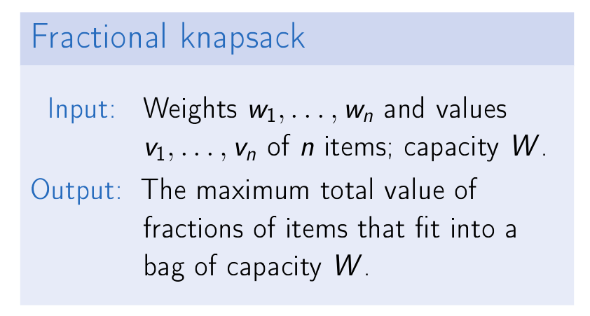
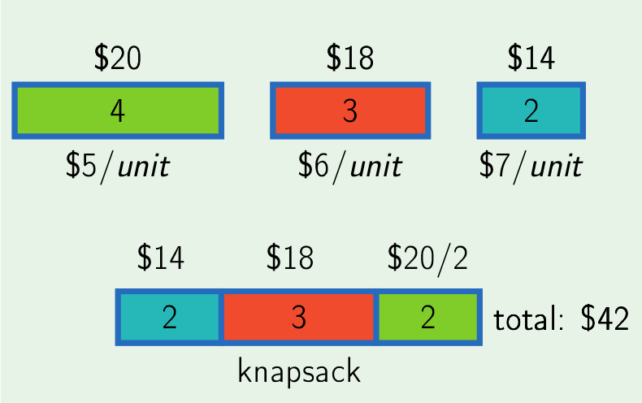
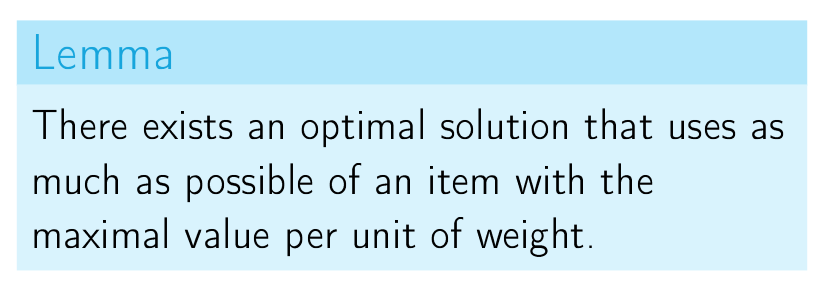

```py
# Next day it will be solved.
```

### Divide-and-Conquer

- Break into non-overlapping subproblems of the same type
- Solve subproblems
- Combine results

#### Linear Search

**Searching** in an **unsorted** array using **linear** search.

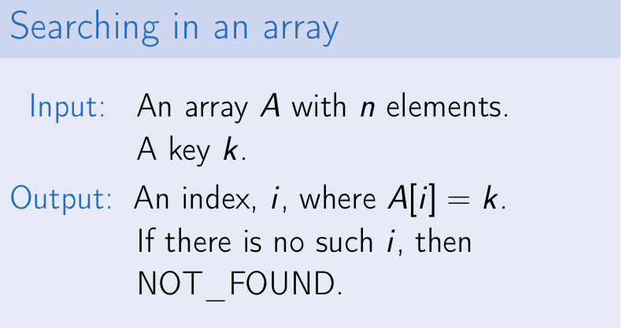

```py
def linear_search_iterative(elements, key):
    """
        An index, i, where A[i] = k.
        If there is no such i, then
        NOT_FOUND.
    """
    for idx, value in enumerate(elements):
        if key == value:
            return idx
    return "Not Found"


def linear_search_recursive(elements, low, high, key):
    if high < low:
        return "Not Found"

    if elements[low] == key:
        return low

    return linear_search_recursive(elements, low + 1, high, key)


def main():
    elements = ['nahid', 'hassan', 'mahin', 'mony', 'joe', 'doe']
    out = linear_search_iterative(elements, 'mahin')
    print(out)
    out = linear_search_recursive(elements, 0, len(elements)-1, 'mahin')
    print(out)


if __name__ == "__main__":
    main()
```

#### Binary Search

**Iterative Method**:

```py
def binary_search_iterative(elements, key):
    low = 0
    high = len(elements) - 1

    while low <= high:
        mid = (low + high) // 2
        if elements[mid] == key:
            # wow! found, return the mid
            return mid
        elif elements[mid] < key:
            # change low
            low = mid + 1
        else:
            # change high
            high = mid - 1
    return low - 1

# test program
elements = [3, 4, 4, 8, 10, 10, 14, 20, 34]
out = binary_search_iterative(elements, 30)
print(out) # 7
```

**Recursive Method**:

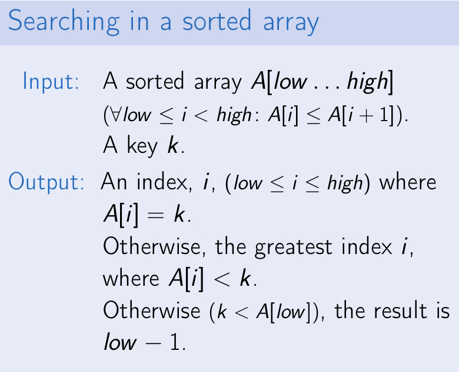
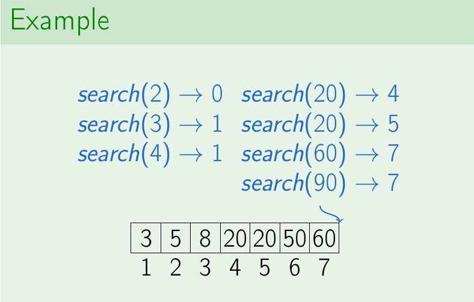
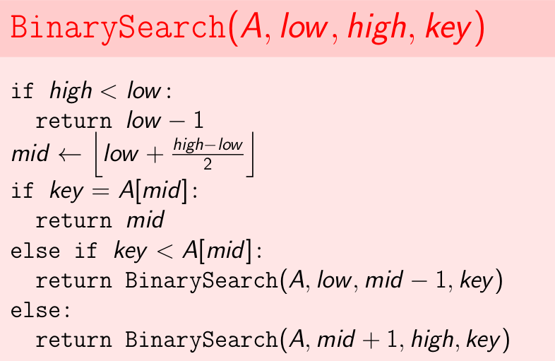
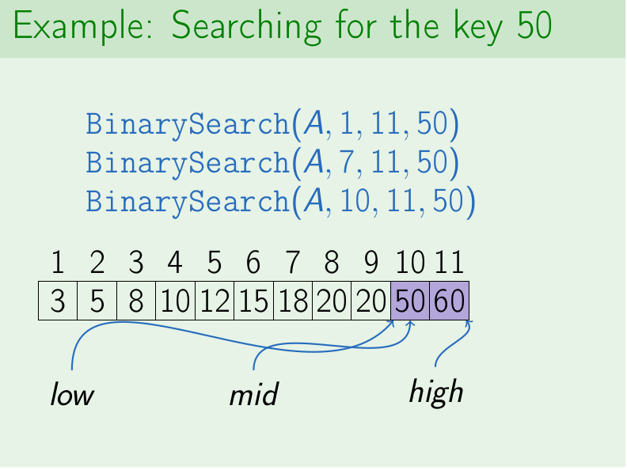

```py
def binary_search_recursive(elements, low, high, key):
    if high < low:
        return low - 1

    mid = int(low + ((high - low) / 2))
    if key == elements[mid]:
        return mid
    elif key < elements[mid]:
        return binary_search_recursive(elements, low, mid-1, key)
    else:
        return binary_search_recursive(elements, mid+1, high, key)


elements = [3, 4, 4, 8, 10, 10, 14, 20, 34]
out = binary_search_recursive(elements, 0, len(elements) - 1, 30)
print(out) # 7
```

**Summary binary search**:

- Break problem into non-overlapping subproblems of the same type.
- Recursively solve those subproblems.
- Combine results of subproblems.

> The **runtime** of binary search is **O(log N)** log base 2

#### Polynomial Multiplication

```py
n = 3
a = (3, 2, 5)
b = (5, 1, 2)

# result
# c = [15, 13, 33, 9, 10]


def polynomial_multiplication_naive(a, b, n):
    product = [0] * (2*n - 1)

    for i in range(n):
        for j in range(n):
            product[i+j] = product[i+j] + a[i] * b[j]

    return product
```
