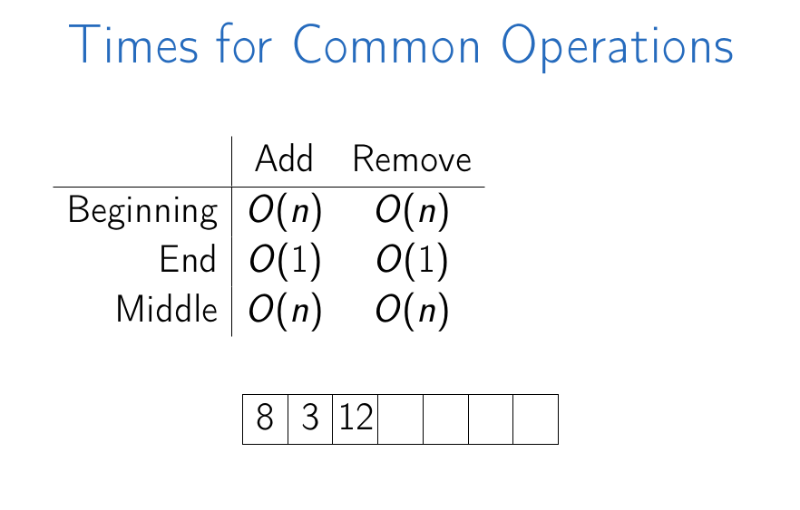

# Data Structures

# Table of Contents

- [Data Structures](#data-structures)
- [Table of Contents](#table-of-contents)
    - [Basic Data Structures](#basic-data-structures)
      - [Arrays](#arrays)

### Basic Data Structures

#### Arrays

**Definition**: `Continuous area of memory` **consisting of equal size elements** `indexed by continuous integers`.

- **Constant-time access** or read and write.
- Address of an array = `array_address + element_size * (i - first_index)`

```text
Given an array whose:

    address is 1000,
    element size is 8
    first index is 0
    What is the address of the element at index 6?

    Calculation => 1000 + 8 * (6 - 0) => 1048

Answer: 1048
```

For multi-dimensional array,

array_address = `array_addr + element_size * ((i - 1) * column_size + (j - 1))`

Multi Dimensional Array:

- `Row Major`
- `Column Major`

Times for Common Operation:



Summary,

- **Array**: contiguous area of memory consisting of equal-size elements indexed by contiguous integers.
- Constant-time access to any element.
- Constant time to add/remove at the end.
- Linear time to add/remove at an arbitrary location.