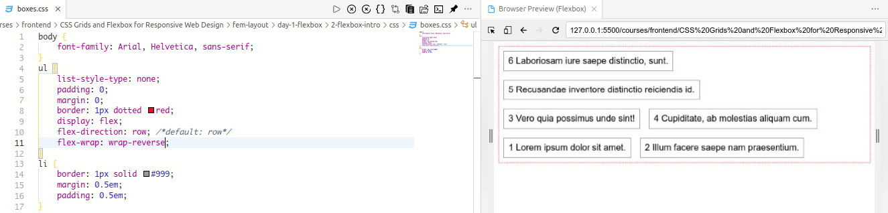
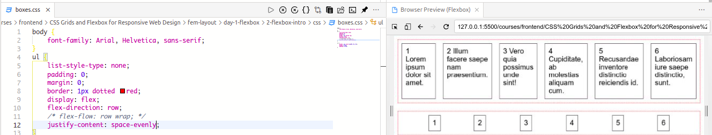
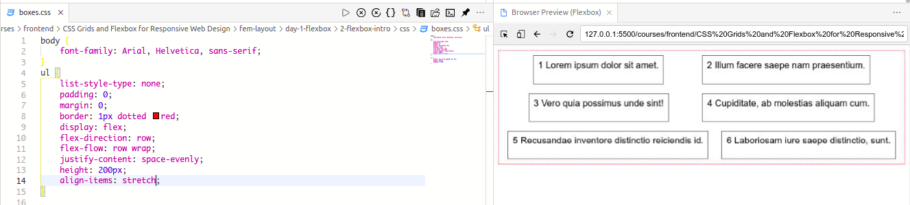

# CSS Grids and Flexbox for Responsive Web Design

[Course Resources](https://github.com/jen4web/fem-layout.git)

- Float
- Flexbox(basically usages in `image` gallery system)
- Flexbox usages as grid layout.

## Table of Contents

- [CSS Grids and Flexbox for Responsive Web Design](#css-grids-and-flexbox-for-responsive-web-design)
  - [Table of Contents](#table-of-contents)
    - [Introduction to Setup](#introduction-to-setup)
      - [Resources](#resources)
      - [Defining Responsive Design](#defining-responsive-design)
    - [Floats](#floats)
      - [Overview of Floats](#overview-of-floats)
      - [Float Exercise](#float-exercise)
    - [Flexbox](#flexbox)
      - [Introducing Flexbox](#introducing-flexbox)
      - [Flex Snippets/ Properties](#flex-snippets-properties)
      - [Flexbox Justification](#flexbox-justification)
      - [Flexbox Alignment](#flexbox-alignment)
      - [Individuals flex-items](#individuals-flex-items)
      - [All Flex Properties](#all-flex-properties)
      - [Flexbox Grid](#flexbox-grid)

### Introduction to Setup

#### Resources

[Course Resources](https://github.com/jen4web/fem-layout.git)

#### Defining Responsive Design

Defined by three characteristics

- **Flexible grid-based layout**
  
- **Media Queries(CSS3)**
  
- **Images that resizes**
  

**Picture Tag**:

`<picture>` tag is brand new HTML 5.1 tag that most commonly used for **responsive** design.

```html
<picture>
  <!-- if screen size at least 650px, logo-big.jpg is showing -->
  <source media="(min-width: 650px)" srcset="logo-big.jpg" />
  <!-- if screen size at least 465px, logo-medium.jpg is showing -->
  <source media="(min-width: 465px)" srcset="logo-medium.jpg" />
  <!-- if screen size at less then 465px, logo-small.jpg is showing -->
  
</picture>
```

### Floats

- `float` is a CSS a property, we can assume that without `float` property we cannot make an webpage or website.

- `float` has `two` values.


```css
* {
  box-sizing: border-box;
  padding: 0;
  margin: 0;
}

body {
  font-family: tahoma;
}

div {
  /* outline: 1px solid red; */
  float: left;
  height: 300px;
}

.ione .itwo .ithree {
  width: 24.5%;
}

.text-one,
.text-two,
.text-three {
  padding-left: 10px;
  width: 74.5%;
}

.text-three {
  float: right;
}
```

```html
<body>
  <div class="ione">
    
  </div>
  <div class="text-one">
    <h1>Computer</h1>
    <p>
      Lorem ipsum, dolor sit amet consectetur adipisicing elit. Adipisci
      voluptate nemo tenetur hic, quaerat, obcaecati placeat, suscipit similique
      nam eius omnis quisquam velit blanditiis consectetur. Minima earum aliquid
      officiis quas.
    </p>
    <br />
    <p>
      Lorem ipsum, dolor sit amet consectetur adipisicing elit. Quod incidunt
      earum quo consequuntur, voluptatibus voluptas officiis tempore voluptates
      quasi vero?
    </p>
    <p>lorem500</p>
  </div>
  <div class="text-two">
    <h1>Computer</h1>
    <p>
      Lorem ipsum, dolor sit amet consectetur adipisicing elit. Adipisci
      voluptate nemo tenetur hic, quaerat, obcaecati placeat, suscipit similique
      nam eius omnis quisquam velit blanditiis consectetur. Minima earum aliquid
      officiis quas.
    </p>
    <br />
    <p>
      Lorem ipsum, dolor sit amet consectetur adipisicing elit. Quod incidunt
      earum quo consequuntur, voluptatibus voluptas officiis tempore voluptates
      quasi vero?
    </p>
    <p>lorem500</p>
  </div>
  <div class="itwo">
    
  </div>
  <div class="text-three">
    <h1>Computer</h1>
    <p>
      Lorem ipsum, dolor sit amet consectetur adipisicing elit. Adipisci
      voluptate nemo tenetur hic, quaerat, obcaecati placeat, suscipit similique
      nam eius omnis quisquam velit blanditiis consectetur. Minima earum aliquid
      officiis quas.
    </p>
    <br />
    <p>
      Lorem ipsum, dolor sit amet consectetur adipisicing elit. Quod incidunt
      earum quo consequuntur, voluptatibus voluptas officiis tempore voluptates
      quasi vero?
    </p>
    <p>lorem500</p>
  </div>

  <div>
    
  </div>
</body>
```


#### Overview of Floats

```text
float: left/right;
clear: left/right/both;
```


```css
* {
  box-sizing: border-box;
}

.row::after {
  content: "";
  clear: both;
  display: table;
}

.col-1 {
  float: left;
  margin-left: 4%;
  width: 21%;
  background-color: darkblue;
  height: 130px;
  margin-bottom: 2pc;
}

.text-center {
  text-align: center;
  padding: 45px 0;
  font-weight: bold;
  font-size: 30px;
  color: white;
}

@media only screen and (min-width: 480px) and (max-width: 767px) {
  .col-1 {
    width: 44%;
  }
}

@media only screen and (max-width: 479px) {
  .col-1 {
    width: 98%;
  }
}

/* attribute selector 
 * Any column that starts with col- is selected. 
*/
/* [class*="col-"] {
    background-color: red;
} */

.col-pull {
  left: -74%;
}
```

```html
<body>
  <div class="row">
    <div class="text-center col-1">col-1</div>
    <div class="text-center col-1">col-2</div>
    <div class="text-center col-1">col-3</div>
    <div class="text-center col-1 col-pull">col-4</div>
  </div>
</body>
```

| Large Screen             | Medium Screen           | Small Screen            |
| ------------------------ | ----------------------- | ----------------------- |
|  |  |  |

#### Float Exercise


### Flexbox

#### Introducing Flexbox


#### Flex Snippets/ Properties

```css
ul {
  display: -webkit-flex; /* target chrome, Safari */
  display: -ms-flexbox; /* target IE10 */
  display: flex;
}
```


**flex-direction**: `row(default)`, `row-reverse`, `column`, `column-reverse`

| Where    | Snippets                          | Output                   |
| -------- | --------------------------------- | ------------------------ |
|          | `Initial`                         |  |
| `parent` | `display: flex;`                  |  |
| `parent` | `flex-direction: column;`         |  |
| `parent` | `flex-direction: column-reverse;` |  |
| `parent` | `flex-direction: row-reverse;`    |  |

**flex-wrap**: `wrap`, `wrap-reverse`, `nowrap(default)`

| Where    | Snippets                   | Output                   |
| -------- | -------------------------- | ------------------------ |
| `parent` | `flex-wrap: wrap;`         |  |
| `parent` | `flex-wrap: nowrap;`       |  |
| `parent` | `flex-wrap: wrap-reverse;` |  |

**flex-flow**:

> **flex-flow**: `flex-direction` `flex-wrap`.
> **flex-flow** is the **shorthand** for both `flex-direction` and `flex-wrap`

| Where    | Snippets                       | Output                   |
| -------- | ------------------------------ | ------------------------ |
| `parent` | `flex-flow: row wrap-reverse;` |  |

#### Flexbox Justification

**justify-content**: `flex-start`, `flex-end`, `center`, `space-between`, `space-around`, `space-evenly`

| Where    | Snippets                          | Output                   |
| -------- | --------------------------------- | ------------------------ |
| `parent` | `justify-content: flex-end;`      |  |
| `parent` | `justify-content: flex-start;`    |  |
| `parent` | `justify-content: center;`        |  |
| `parent` | `justify-content: space-around;`  |  |
| `parent` | `justify-content: space-between;` |  |
| `parent` | `justify-content: space-evenly;`  |  |

#### Flexbox Alignment

**align-items**: `flex-start`, `flex-end`, `center`, `baseline`, `stretch(default)`

| Where    | Snippets                   | Output                   |
| -------- | -------------------------- | ------------------------ |
|          | `Initial`                  |  |
| `parent` | `align-items: flex-start;` |  |
| `parent` | `align-items: flex-start;` |  |
| `parent` | `align-items: center;`     |  |
| `parent` | `align-items: baseline;`   |  |
| `parent` | `align-items: stretch;`    |  |

#### Individuals flex-items

**order**:

By default every elements **order** is `1`. If you change the order greater than 1, then it pushed down the element on bottom of the stack.

```css
.flex2 {
  border: 2px dashed darkblue;
  order: 2; /* other values is 0,1,2,3,4,5*/
  /* higher order means pushed down it below on the stack */
}
```

**flex-grow, flex-shrink, flex-basis**:

`flex` is the shorthand for `flex-grow`, `flex-shrink` and `flex-basis`

```css
.flex2 {
  /* `flex` is the shorthand for `flex-grow`, `flex-shrink` and `flex-basis`
 */
  /* GSB (0 1 auto) default for flex;*/
  /* flex: 3 5 25%; */
  flex: 0 1 25%;
}
```

For visualize how `flexbox` work. Play those games,

1. [Flexbox Froggy for learn CSS Flexbox](https://flexboxfroggy.com/)
2. [Flexbox Defense](http://www.flexboxdefense.com/)

#### All Flex Properties

[CSS Tricks Flexbox](https://css-tricks.com/snippets/css/a-guide-to-flexbox/)

```css
display: flex;
```

| Where    | Property          | Value                                                                               |
| -------- | ----------------- | ----------------------------------------------------------------------------------- |
| _Parent_ | `flex-direction`  | `row`, `row-reverse`, `column`, `column-reverse`                                    |
| _Parent_ | `flex-wrap`       | `wrap`, `nowrap`, `wrap-reverse`                                                    |
| _Parent_ | `flex-flow`:      | **Shorthand** for `flex-direction` and `flex-wrap`                                  |
| _Parent_ | `justify-content` | `flex-start`, `flex-end`, `center`, `space-between`, `space-around`, `space-evenly` |
| _Parent_ | `align-items`     | `flex-start`, `flex-end`, `center`, `stretch`, `baseline`                           |
| _Parent_ | `align-contents`  | `flex-start`, `flex-end`, `center`, `space-between`, `space-around`, `space-evenly` |
| _Child_  | `order`           | `1(default)`, `<integer both positive and negative)>`                               |
| _Child_  | `flex-basis`      | `25%`, `3rem`, `auto` etc.                                                          |
| _Child_  | `flex-shrink`     | `<integer>`                                                                         |
| _Child_  | `flex-grow`       | `<integer>`                                                                         |
| _Child_  | `flex`            | **Shorthand** for `flex-grow`, `flex-shrink`, `flex-basis`                          |
| _Child_  | `flex-self`       | `flex-start`, `flex-end`, `center`, `stretch`, `baseline`                           |

#### Flexbox Grid