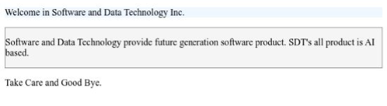

# Essential HTML

**HTML Tag you must know**:

| H          | T        | M     | L      | Tag     |
| ---------- | -------- | ----- | ------ | ------- |
| `div`      | section  | form  | input  | table   |
| header     | footer   | aside | nav    | option  |
| optgroup   | progress | meter | map    | img     |
| heading    | p        | a     | list   | marquee |
| textarea   | script   | link  | hr     | meta    |
| blockquote | code     | pre   | button | embed   |

## Table of Contents

- [Essential HTML](#essential-html)
  - [Table of Contents](#table-of-contents)
    - [Div Tag](#div-tag)

### Div Tag

- `<div>` stands for `division`
- Div is `block level` tag
- Used to divide content into logical sections.
- The `<div>` tag defines a division or a section on the HTML document.
- The `<div>` tag is often used as a container for other HTML elements.
- By default, browsers always place a line break `before` and `after` the `<div>` element. However, this can be changed with `CSS`.

```html
<!DOCTYPE html>
<html lang="en">
  <head>
    <title>Division Tag</title>
  </head>

  <body>
    <div style="background-color: aliceblue;">
      <p>Welcome in Software and Data Technology Inc.</p>
    </div>
    <div style="border: 1px solid gray; background-color: whitesmoke;">
      <p>
        Software and Data Technology provide future generation software product.
        SDT's all product is AI based.
      </p>
    </div>
    <p>Take Care and Good Bye.</p>
  </body>
</html>
```


