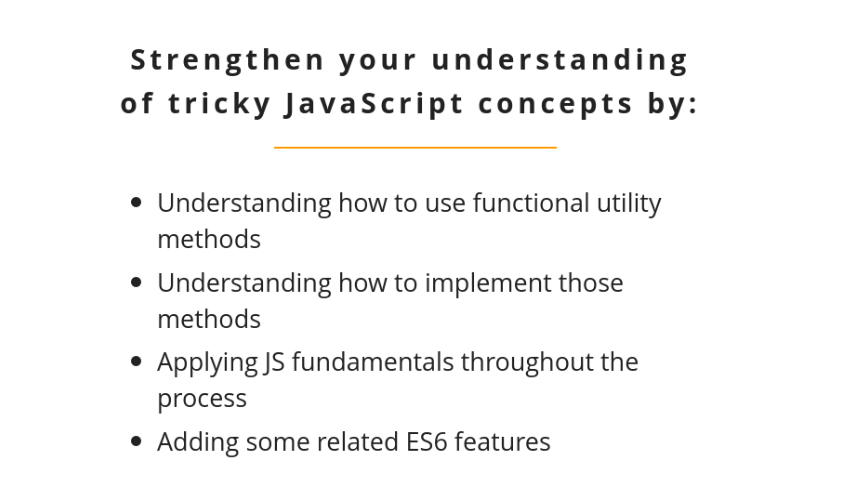

# JavaScript: From Fundamentals to Functional JS, v2

## Table of Contents

- [JavaScript: From Fundamentals to Functional JS, v2](#javascript-from-fundamentals-to-functional-js-v2)
  - [Table of Contents](#table-of-contents)
    - [Course Introduction](#course-introduction)
    - [Object and Arrays(Data Structures)](#object-and-arraysdata-structures)
      - [Property Access](#property-access)
      - [Arrays](#arrays)
      - [Bracket Notation](#bracket-notation)

### Course Introduction

This course is not about functional programming. But it will prepare you well if you decide to take the next step in that journey and most importantly, it will make you a more confident and capable JavaScript programmer.



> Be **sincere**, not serious.

**How to success?**:

- Difficulty ramps up considerably, but if you stick with it you will reap the rewards.
- Take responsibility for your learning.
- Consider the question I ask you.

> Be a good learner.

- Functional programming is about **verbs(action)**.
  - Functional programming don't have side effects, and it easier to debug your code, test and trust.
- OPP is about **nouns(property)**.

### Object and Arrays(Data Structures)

#### Property Access

1. Property Access
2. Dot vs Brackets
3. Destructing
4. Nesting + Loops
5. Nesting + Destructing

**Assignments with Dots**:

- `Primitive`(string, number, boolean, null, undefined...) values get pass by **value**(allocate different place of memory, **copied** every time)

- `Non-primitive`(object, array, function, promise) values get pass by **reference**(**sharing** the same place of memory)

```js
let person = {};

// Anything that you ever uses a dot in JavaScript is an object.
// assignment
person.name = "Md. Nahid Hassan Senior";
console.log(person.name);                     // Md. Nahid Hassan Senior
// same
// console.log(person['name']);

let person1 = {
  name: "Md. Nahid Hassan Junior",
};
console.log(person1.name);                    // Md. Nahid Hassan Junior

// return
let who = person.name;
console.log(who);                             // Md. Nahid Hassan Senior

person.name = "Mehedi Hassan Mahin";
// who is stored by value
console.log(who);                             // Md. Nahid Hassan Senior
console.log(person.name);                     // Mehedi Hassan Mahin

console.log(who.story);                       // undefined
```

#### Arrays

```js
// declare an array object
let person = [];

// add an array property
person.name = "Md. Nahid Hassan.";

// retrieve array property
let who = person.name;
console.log(who); // Md. Nahid Hassan

// see the type of the person
console.log(typeof person); // object

// add some data into the array
for (let i = 0; i < 10; i++) {
  person[i] = i * 10;
}
console.log(person); // [ 0, 10, 20, 30, 40, 50, 60, 70, 80, 90, name: 'Md. Nahid Hassan.' ]

// array length property
console.log(person.length);

person.forEach(element => {
    console.log(element);
    // print out 0\n-90\n
});
```

#### Bracket Notation

```js
let person = [];
person.name = "Md. Nahid Hassan";
let who = person.name;
person[10] = "I am a student.";

console.log(person["10"]); //  "I am a student."
console.log(person[10]); // "I am a student."


console.log(person[]);
// [ <10 empty items>, 'I am a student.', name: 'Md. Nahid Hassan' ]

let age = "age";
person[age] = 23;

console.log(person.age);

console.log(person); // 23

/**
 * [ <10 empty items>,
 * 'I am a student.',
 * name: 'Md. Nahid Hassan',
 * age: 23 ]
 */
```