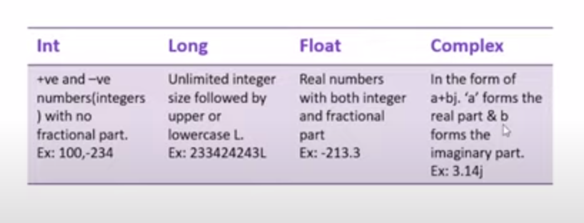

# Python Interview Question and Answer

## Table of Contents

- [Python Interview Question and Answer](#python-interview-question-and-answer)
  - [Table of Contents](#table-of-contents)
    - [What are keyboards in Python?](#what-are-keyboards-in-python)
    - [What are the literals in Python and explain about the different literals](#what-are-the-literals-in-python-and-explain-about-the-different-literals)

### What are keyboards in Python?

- Python keywords are special reserved words.
- Convey a special meaning to compiler/interpreter.
- Each keyboard has special meaning and a specific operation.
- Never use it as a variable.
- Total 33 keywords.
- Keywords are casesensitive.

| Key      | W   | o       | r        | d      | s     |
| -------- | --- | ------- | -------- | ------ | ----- |
| assert   | def | class   | continue | break  | True  |
| else     | if  | finally | elif     | del    | False |
| global   | for | if      | from     | pass   | None  |
| raise    | try | or      | return   | import | and   |
| nonlocal | in  | not     | is       | lambda | as    |

### What are the literals in Python and explain about the different literals

Literals the **constant** used in Python.

- String literals

```py
first_name = 'Md. Nahid'
last_name = "Hassan"
```

- Numeric literals



- Boolean literals

```py
flag = True # 1
flag = False # 0
```

- Special literals

```py
# Python has one special literal: "None"
# Used to specify to the field that is not created.

value = None
```